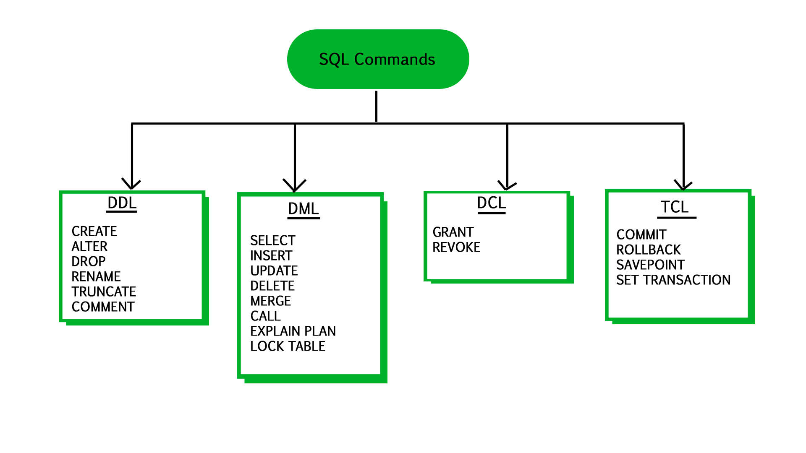

# Вариант 5

Настроить `pgAudit` для логирования всех `DDL`-операций в базе данных. Создать триггер, который записывает изменения в
таблице `inventory` при операциях `INSERT` и `UPDATE`, добавляя время и пользователя в `audit_log`.

> https://kesh.kz/blog/%D0%B0%D1%83%D0%B4%D0%B8%D1%82-postgresql/

Все `DDL` операции представлены на фото ниже: 



Исходя из документации на фото ниже все `DDL` операции можно включить, используя комбинацию `DDL` и `ROLE`. 


Пример для создания таблицы, в консоли должно все логгироваться и быть видно: 

```sql
CREATE TABLE pupa (
    id SERIAL NOT NULL,
    name VARCHAR(15) NOT NULL
);
```


```sql
DROP TABLE pupa;
```


Проверяем теперь триггер (в логах, т.е в консоли ничего не должно быть видно):

```sql
INSERT INTO inventory (item_name, category, quantity, price)
VALUES ('Ноутбук с бубунтой', 'Электроника', 20, 650.11);
```

Проверим теперь триггер на обновление: 

```sql
UPDATE inventory 
SET item_name = 'Ноутбук arch linux'
WHERE item_name = 'Ноутбук с бубунтой';
```

