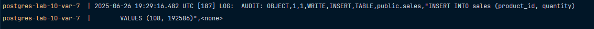
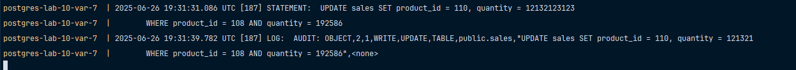

# Вариант 7

Настроить `pgAudit` для логирования операций `INSERT` и `UPDATE` в таблице `sales`. 
Создать триггер для записи изменений при операциях `UPDATE` в `sales`, добавляя в `audit_log` старое и новое
значения полей `amount` и `status`.

> https://kesh.kz/blog/%D0%B0%D1%83%D0%B4%D0%B8%D1%82-postgresql/

Проверка, что логгируется `INSERT` в таблице `sales`:

```sql
INSERT INTO sales (amount, status, quantity)
VALUES (108.123, 'Круто', 192586);
```



```sql
UPDATE sales SET product_id = 110, quantity = 12132123123
WHERE amount = 108.123 AND status = 'Круто';
```



```sql
DELETE FROM sales WHERE (amount = 108.123 AND quantity = 12132123123);
```