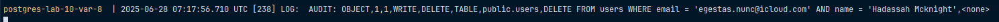
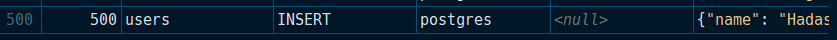

# Вариант 8

Включить логирование операций `DELETE` в таблице `users` с помощью `pgAudit`. 
Создать триггер, который записывает изменения при `INSERT` в `users`, фиксируя в `audit_log` время,
пользователя и введённые данные.

Проверим логирование операции для `DELETE`, для этого воспользуемся командой, которая представлена ниже: 

```sql
DELETE FROM users WHERE email = 'egestas.nunc@icloud.com' AND name = 'Hadassah Mcknight';
```



Теперь проверим триггер на `INSERT`, заодно посмотрев на то, что операция не логгируется: 

```sql
INSERT INTO users (email, name) VALUES ('egestas.nunc@icloud.com','Hadassah Mcknight');
```

