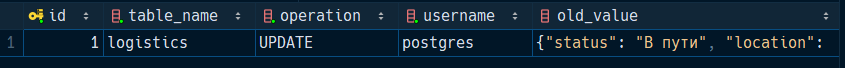
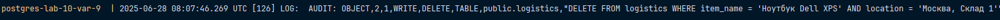

# Вариант 9

Настроить `pgAudit` для фиксации операций `UPDATE` и `DELETE` в таблице `logistics`.
Создать триггер, записывающий все изменения в `logistics` при `UPDATE`, добавляя в `audit_log` старые значения
полей `location` и `status`.

Проверим теперь, что операция `UPDATE` логгируется и добавляется триггером в `audit_log`:

```sql
UPDATE logistics SET status = 'Приехали', quantity = 15 
WHERE item_name = 'Ноутбук Dell XPS' AND location = 'Москва, Склад 1';
```




Теперь проверим, что данная запись логгируется с помощью `pgaudit`:

```sql
DELETE FROM logistics WHERE item_name = 'Ноутбук Dell XPS' AND location = 'Москва, Склад 1';
```




