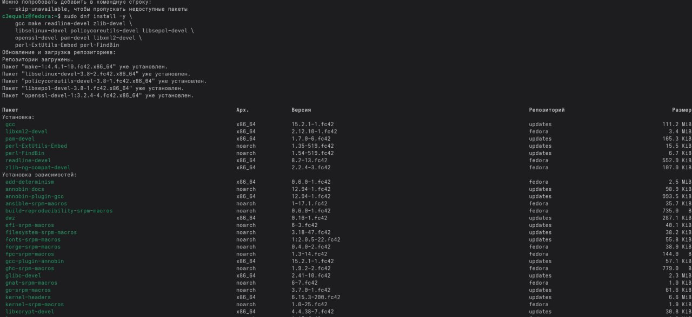
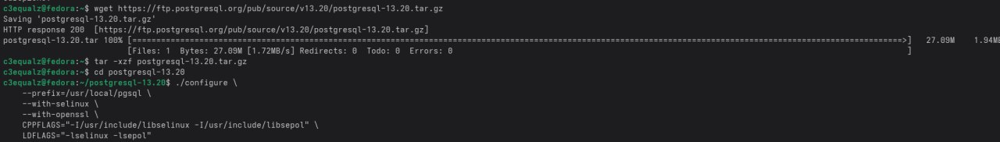
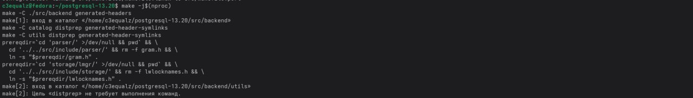
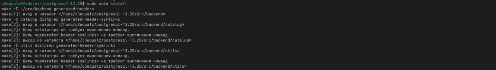
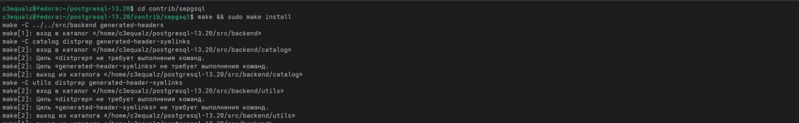
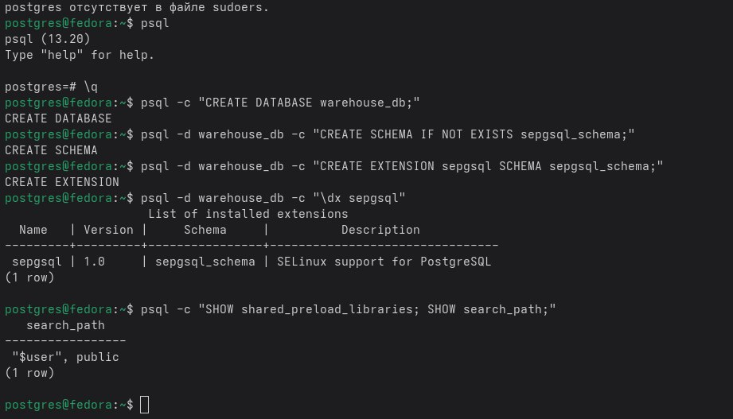
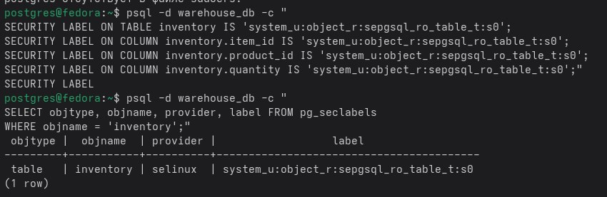
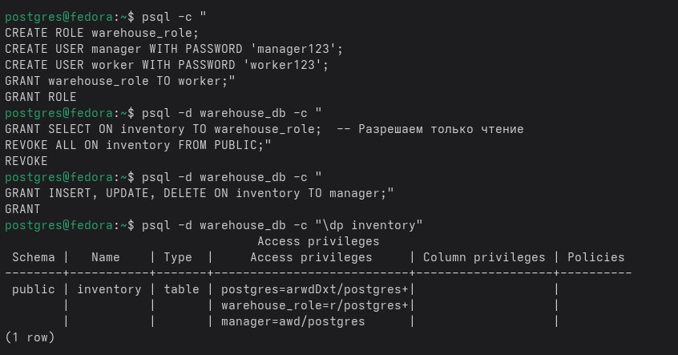
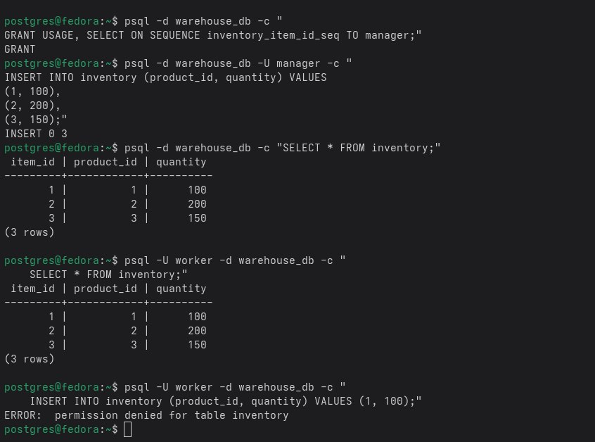
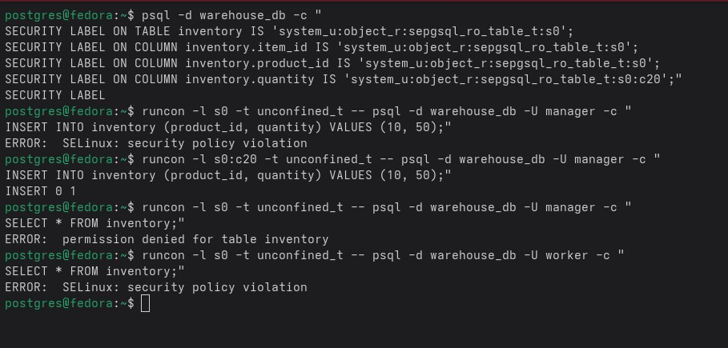

# 11 лабораторная (6 вариант)

## Условие

Создайте таблицу `inventory` с полями `item_id`, `product_id`, `quantity`. Реализуйте мандатное управление доступом: метки
`restricted` запрещают изменение данных пользователями с уровнем доступа ниже `restricted`. Настройте дискреционный
доступ для роли `warehouse_role`, которая может только просматривать данные.

### Установка `PostgreSQL`

> [!IMPORTANT]
> - Интеграция `SELinux` и `PostgreSQL` является устаревшей вещью, которую перестали поддерживать. Вам подойдет только `PostgreSQL` до 14 версии. 
> - В `Docker` не получится развернуть базу данных из-за требований `SELinux`
> - `SELinux` в большинстве `Linux` систем не активирован. Он активно работает только в `RHEL` дистрибутивах со старта, поэтому советую ставить `CentOS`, `Fedora`, `Red Hat`.

> [!NOTE]
> В моем случае я буду использовать `Fedora 42` и `PostgreSQL 13.20`. 

Обновляем систему, используя команду, которая представлена ниже: 

```bash
sudo dnf -y upgrade
```

> [!NOTE]
> Если будут проблемы с установкой некоторых пакетов, то нужно сделать `exclude`. 
> Скиньте просто логи в `LLM` и вам будет расписано какую команду выполнить. 

`PostgreSQL` нам придется собирать вручную, потому что в большинстве случаев в репозиториях лежат пакеты без поддержки `sepgsql`. 

Используйте данную команду, чтобы скачать нужные зависимости: 

```bash
sudo dnf install -y \
    gcc make readline-devel zlib-devel \
    libselinux-devel policycoreutils-devel libsepol-devel \
    openssl-devel pam-devel libxml2-devel \
    perl-ExtUtils-Embed perl-FindBin
```



Теперь через `wget` скачаем нужный пакет для `PostgreSQL`, команда представлена ниже: 

```bash
wget https://ftp.postgresql.org/pub/source/v13.20/postgresql-13.20.tar.gz
```

Распаковываем `tar` архив: 

```bash
tar -xzf postgresql-13.20.tar.gz
```

Заходим в нужную директорию, используя команду, которая представлена ниже: 

```bash
cd postgresql-13.20
```



Конфигурация сборки с `SELinux`:

```bash
./configure \
    --prefix=/usr/local/pgsql \
    --with-selinux \
    --with-openssl \
    CPPFLAGS="-I/usr/include/libselinux -I/usr/include/libsepol" \
    LDFLAGS="-lselinux -lsepol"
```

Сборка: 

```bash
make -j$(nproc)
```



Установка: 

```bash
sudo make install
```



Теперь нужно собрать `sepgsql`, используя команду, для этого переходим в директорию: 

```bash
cd contrib/sepgsql
```

Теперь собираем:

```bash
make && sudo make install
```



Проверка, что файлы появились: 

```bash
sudo ls -l /usr/local/pgsql/lib/sepgsql.so
```

```bash
sudo ls -l /usr/local/pgsql/share/extension/sepgsql*
```

> [!NOTE]
> Если в `extension` не появился `sepgsql.sql`, то это значит, что его установщик поместил в другую директорию. 
> Посмотрите по логам куда он делал и поменяйте команду немного, которая представлена ниже. 
> На `CentOS 9` установщик положил в `extension`, на `Fedora` было в другой директории. Опять-таки посмотрите по логам выше. 

Теперь надо пофиксить версии, потому что без данных метаданных ничего не заведется: 

```bash
sudo mv /usr/local/pgsql/share/extension/sepgsql.sql /usr/local/pgsql/share/extension/sepgsql--1.0.sql
```

> [!IMPORTANT]
> Вместо данного пути - `/usr/local/pgsql/share/extension/sepgsql.sql` может быть иной. 
> Посмотрите по логам куда делся `sepgsql.sql`. 

Выполняем теперь данную команду для метаданных:

```bash
sudo tee /usr/local/pgsql/share/extension/sepgsql.control <<EOF
comment = 'SELinux support for PostgreSQL'
default_version = '1.0'
module_pathname = '\$libdir/sepgsql'
relocatable = false
EOF
```

Добавьте путь к бинарникам в `PATH`:

```bash
echo 'export PATH=/usr/local/pgsql/bin:$PATH' >> ~/.bashrc
source ~/.bashrc
```

Создаем пользователя: 

```bash
sudo adduser postgres
```

Создаем директорию, где `PostgreSQL` будет хранить свои данные: 

```bash
sudo mkdir /usr/local/pgsql/data
```

Назначаем права для пользователя `postgres`:

```bash
sudo chown postgres:postgres /usr/local/pgsql/data
```

Задайте для пользователя `postgres` пароль

```bash
sudo passwd postgres
```

Инициализируем базу данных:

```bash
sudo -u postgres /usr/local/pgsql/bin/initdb -D /usr/local/pgsql/data
```

Настройка конфига для интеграции `PostgreSQL` и `sepgsql`:

```bash
echo "shared_preload_libraries = 'sepgsql'" >> /usr/local/pgsql/data/postgresql.conf
```

> [!NOTE]
> Если через `echo` не дает доступ, то просто откройте через `nano`.
> Нажимаем `CTRL + F` и вбиваем `shared_preload_libraries`, там нужно убрать комментарий - `#` и поставить в кавычках `sepgsql`. 

Теперь создадим `service` файл для запуска `PostgreSQL`:

```bash
sudo nano /etc/systemd/system/postgresql.service
```

Вставьте данные, которые представлены ниже: 

```
[Unit]
Description=PostgreSQL database server
After=network.target

[Service]
Type=notify
User=postgres
ExecStart=/usr/local/pgsql/bin/postgres -D /usr/local/pgsql/data
ExecReload=/bin/kill -HUP $MAINPID
KillMode=mixed
KillSignal=SIGINT
TimeoutSec=0

[Install]
WantedBy=multi-user.target
```

Теперь перезагружаем демона, используя команду: 

```bash
sudo systemctl daemon-reload
```

Теперь стартуем процесс `PostgreSQL`, используя команду, которая представлена ниже:

```bash
sudo systemctl enable postgresql
```

Перезапускаем `postgresql`:

```bash
sudo systemctl restart postgresql
```

> [!NOTE]
> Если выдает ошибку перезапуска, то вы отделались малой кровью. 
> Здесь просто перезапустите ваше устройство физически. 
> Если же на этапе `enable` сломалось, то у меня плохие новости....
> Установка неправильная и вы сделали что-то не так или же ОС имеет другое поведение процессов `systemd`.

Переходим в пользователя `postgres`, начиная с этого момента все делаем из под него.
Так как будет использоваться `sudo`, то для пользователя `postgres` нужен пароль, и прописать его в `sudoers`. 
Ну или все команды которые требуют уровня `root` выполнять через `sudo` от другого пользователя.

> [!NOTE]
> Если вы ранее задали через `passwd`, то проблем с паролем не будет. 

```bash
sudo su - postgres
```

Выполняем ещё раз инициализацию базы данных:

```bash
/usr/local/pgsql/bin/initdb -D /usr/local/pgsql/data
```

Теперь ставим последние зависимости для `SELinux`: 

```bash
sudo dnf install -y setools-console policycoreutils-deve
```

Теперь проверьте какие метки существуют. У вас должно быть много меток, которые связаны с `sepgsql`:

```bash
seinfo -t | grep sepgsql
```

В моем случае был такой список:

```bash
sepgsql_blob_t
sepgsql_db_t
sepgsql_fixed_table_t
sepgsql_lang_t
sepgsql_priv_lang_t
sepgsql_proc_exec_t
sepgsql_ranged_proc_exec_t
sepgsql_ranged_proc_t
sepgsql_ro_blob_t
sepgsql_ro_table_t
sepgsql_safe_lang_t
sepgsql_schema_t
sepgsql_secret_blob_t
sepgsql_secret_table_t
sepgsql_seq_t
sepgsql_sysobj_t
sepgsql_table_t
sepgsql_temp_object_t
sepgsql_trusted_proc_exec_t
sepgsql_trusted_proc_t
sepgsql_view_t
unpriv_sepgsql_blob_t
unpriv_sepgsql_proc_exec_t
unpriv_sepgsql_schema_t
unpriv_sepgsql_seq_t
unpriv_sepgsql_sysobj_t
unpriv_sepgsql_table_t
unpriv_sepgsql_view_t
user_sepgsql_blob_t
user_sepgsql_proc_exec_t
user_sepgsql_schema_t
user_sepgsql_seq_t
user_sepgsql_sysobj_t
user_sepgsql_table_t
user_sepgsql_view_t
```

Поздравляю, вы установили `PostgreSQL`, на это было мной потрачено 2 недели. 

### Выполнение лабораторной работы

Отключаем на время `SELinux`, чтобы вставлять данные и размечать их под наши нужды. 

```bash
sudo setenforce 0
```

Создаем базу данных:

```bash
psql -c "CREATE DATABASE warehouse_db;"
```

> [!NOTE]
> Если выдало ошибку, что нет команды `psql`, то попробуйте открыть процесс в другой вкладке терминала и заново зайти за `postgres`.
> Если снова есть ошибка, то система не видит `bin`. Попросите просто у нейронки помощи, отправив команду и вывод ошибки.

Создаем схему, используя команду, которая представлена ниже:

```bash
psql -d warehouse_db -c "CREATE SCHEMA IF NOT EXISTS sepgsql_schema;"
```

Создаем расширение в схеме: 

```bash
psql -d warehouse_db -c "CREATE EXTENSION sepgsql SCHEMA sepgsql_schema;"
```

Врубаем заново `SELinux`:

```bash
sudo setenforce 1
```

Теперь посмотрим по метаданным в базе данных, что расширение `sepgsql` установлено: 

```bash
psql -d warehouse_db -c "\dx sepgsql"
```

> [!NOTE]
> `psql` - клиент `PostgreSQL` для взаимодействия с базой данных.
> `-d warehouse_db` - подключается к базе данных с именем `warehouse_db`.
> `-c` - флаг, указывающий что будет выполнена однострочная команда.
> `\dx` - метакоманда `psql` для показа установленных расширений.
> `sepgsql` - конкретное расширение, информацию о котором нужно показать

```bash
psql -c "SHOW shared_preload_libraries; SHOW search_path;"
```



Навесим теперь лейблы для защиты:

```bash
psql -d warehouse_db -c "
SECURITY LABEL ON TABLE inventory IS 'system_u:object_r:sepgsql_ro_table_t:s0';
SECURITY LABEL ON COLUMN inventory.item_id IS 'system_u:object_r:sepgsql_ro_table_t:s0';
SECURITY LABEL ON COLUMN inventory.product_id IS 'system_u:object_r:sepgsql_ro_table_t:s0';
SECURITY LABEL ON COLUMN inventory.quantity IS 'system_u:object_r:sepgsql_ro_table_t:s0';"
```

> [!NOTE]
> Метка `sepgsql_ro_table_t` (`read-only`) будет:
> Разрешать `SELECT` для всех пользователей 
> Запрещать `INSERT`/`UPDATE`/`DELETE` для пользователей без прав `restricted`.

Проверим теперь какие лейблы применились что и как: 

```bash
psql -d warehouse_db -c "
SELECT objtype, objname, provider, label FROM pg_seclabels 
WHERE objname = 'inventory';"
```



Создадим теперь роли для `DAC` и `MAC`:

```bash
psql -c "
CREATE ROLE warehouse_role;
CREATE USER manager WITH PASSWORD 'manager123';
CREATE USER worker WITH PASSWORD 'worker123';
GRANT warehouse_role TO worker;"
```

Выдаем `DAC` права:

```bash
psql -d warehouse_db -c "
GRANT SELECT ON inventory TO warehouse_role;  -- Разрешаем только чтение
REVOKE ALL ON inventory FROM PUBLIC;"
```

```bash
psql -d warehouse_db -c "
GRANT INSERT, UPDATE, DELETE ON inventory TO manager;"
```

Посмотрим теперь какие есть права за какого пользователя:

```bash
psql -d warehouse_db -c "\dp inventory"
```



Выдаем права теперь менеджеру, чтобы он мог заполнять данные:

```bash
psql -d warehouse_db -c "
GRANT USAGE, SELECT ON SEQUENCE inventory_item_id_seq TO manager;"
```

#### Тестирование `DAC`

Просмотрим что есть у нас:

```bash
psql -d warehouse_db -c "SELECT * FROM inventory;"
```

> [!NOTE]
> За пользователя `Postgres` все видно. 

Теперь попробуем за `worker`, который может читать данные:

```bash
psql -U worker -d warehouse_db -c "SELECT * FROM inventory;"
```
Теперь попробуем за `worker`, у него не будет доступа к изменению данных:

```bash
psql -U worker -d warehouse_db -c "
   INSERT INTO inventory (product_id, quantity) VALUES (1, 100);"
```



#### Тестирование `MAC`

Первоначально не применялись метки, чтобы можно было протестировать `DAC`, поменяем теперь метки:

```bash
psql -d warehouse_db -c "
SECURITY LABEL ON TABLE inventory IS 'system_u:object_r:sepgsql_ro_table_t:s0';
SECURITY LABEL ON COLUMN inventory.item_id IS 'system_u:object_r:sepgsql_ro_table_t:s0';
SECURITY LABEL ON COLUMN inventory.product_id IS 'system_u:object_r:sepgsql_ro_table_t:s0';
SECURITY LABEL ON COLUMN inventory.quantity IS 'system_u:object_r:sepgsql_ro_table_t:s0:c20';"
```

Теперь попробуем вставить, у нас тут не будет полного доступа:

```bash
runcon -l s0 -t unconfined_t -- psql -d warehouse_db -U manager -c "
INSERT INTO inventory (product_id, quantity) VALUES (10, 50);"
```

Здесь получиться вставить: 

```bash
runcon -l s0:c20 -t unconfined_t -- psql -d warehouse_db -U manager -c "
INSERT INTO inventory (product_id, quantity) VALUES (10, 50);"
```




