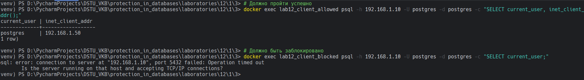

## 3. Проверьте, что доступ с разрешенных IP-адресов возможен, а с других — запрещен.

Для выполнения запросов будем пользоваться скриптами, которые представлены ниже. 

Первый скрипт для проверки успешного подключения представлен ниже: 

```bash
docker exec lab12_client_allowed psql -h 192.168.1.10 -U postgres -d postgres -c "SELECT current_user, inet_client_addr();"
```

Второй скрипт для проверки провального подключения представлен ниже: 

```bash
docker exec lab12_client_blocked psql -h 192.168.1.10 -U postgres -d postgres -c "SELECT current_user;"
```

