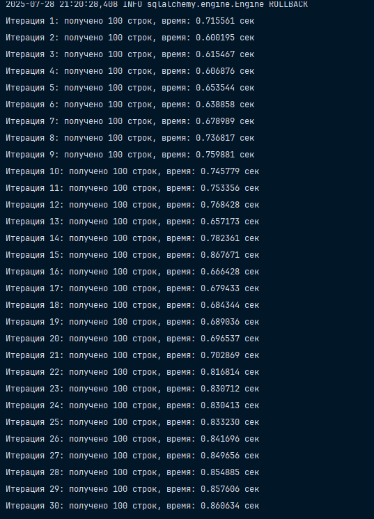
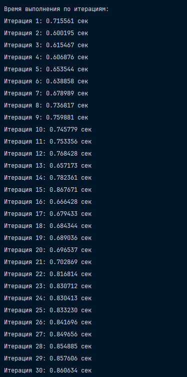
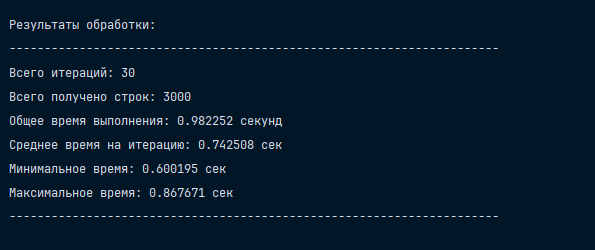

# Замерить время, требуемое для выполнение внутреннего объединения двух таблиц (`istudents.mark` и `istudents.studplan`) по условию объединения: `mark INNER JOIN studplan on mark.studplan_fk = studplan.id`. При этом выбирать не более 100 записей из результатов объединения (для этого использовать `LIMIT 100`). Выполнить запрос 30 раз и каждый раз выбирать разные 100 записей – для этого использовать `OFFSET` (например, так `SELECT * FROM mark INNER JOIN studplan on mark.studplan_fk = studplan.id LIMIT 100 OFFSET 900`).

## Установка

Для установки все то же самое, что было и для прошлых заданий. Никакой разницы нет. 

## Выполнение лабораторной работы

Просто нажмите на запуск `main.py`, в моем случае вышло то, что представлено ниже: 

