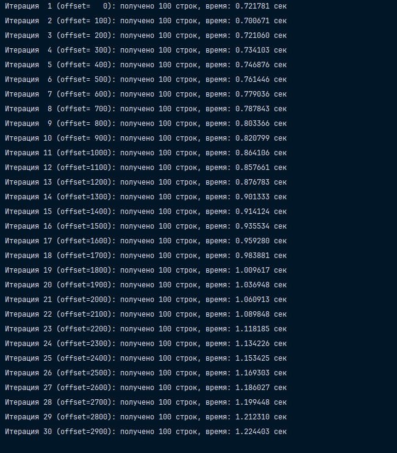

# Выполнить запросы из п.10 - 30 раз, замерить время и оценить полученные результаты статистики. 

### Установка

Для установки используйте то же самое, что и в прошлых пунктах. 

### Выполнение лабораторной работы

В принципе у меня получились такие вот результаты при измерении. 

