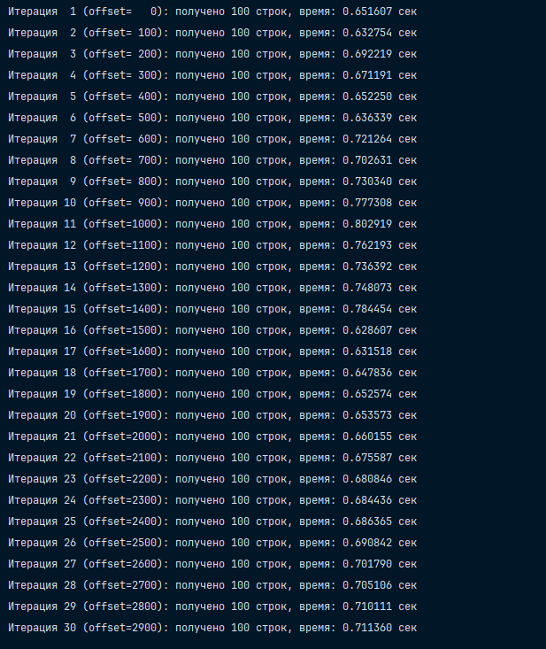
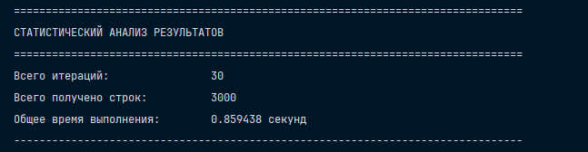
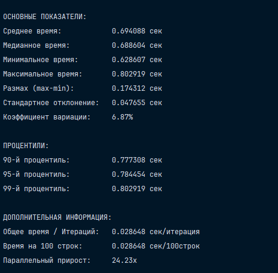
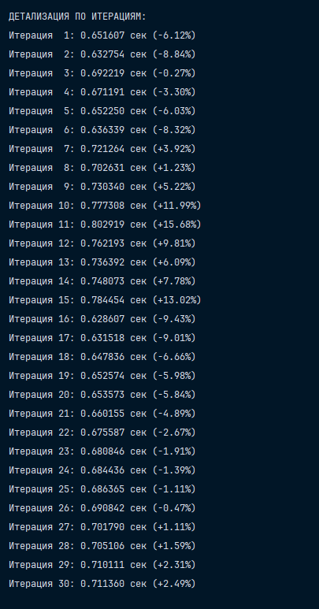

# Повторить запросы из п.10 – 30 раз, замерить время и оценить полученные результаты статистически

## Установка 

В принципе установка от прошлых заданий не меняется. Главное бэкап вставить, сделать `.env` и `uv sync`

## Выполнение задания

