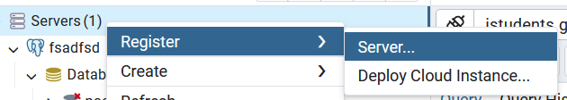
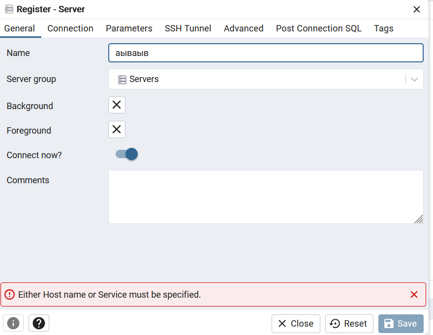
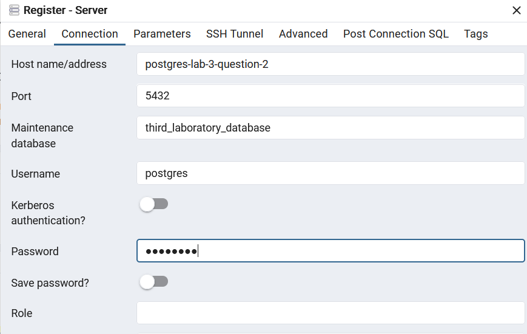
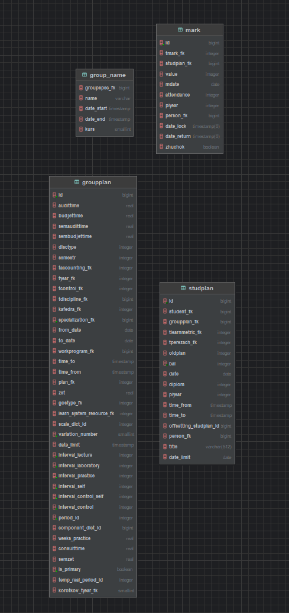

# Восстановить БД из бэкапа (разархивировать, восстановить в `pgadmin`) в схему `istudents`

> [!IMPORTANT]
> Создайте файл `.env` в данной директории, скопировав значения [отсюда](.env.example)

> [!IMPORTANT]
> Скачайте файл `istudents_lab.backup`, который вам пришлет староста.
> Я его, к сожалению, не могу добавить его на `GitHub`, потому что он очень много весит. 
> Вам нужно его расположить в данной [директории](scripts/restore).

В моем случае восстановление бэкапа представлено в файле [здесь](scripts/restore/script.sh). 
Он запускается через отдельный контейнер.

> [!IMPORTANT]
> Пользователь, которого я создал - это `postgres`, а пароль от его учетной записи - `postgres`. 
> Текущие значения у меня заданы в `.env`. Пример смотрите [здесь](.env.example) 

### Как посмотреть что там из бэкапа восстановилось?

Если вы хотите просмотреть какие таблицы получились в итоге, то вам нужно зайти в `pgadmin`. 
Для этого в браузере в моем случае я вбиваю `localhost:5050`. 

> [!NOTE]
> У меня в `.env` `PGADMIN_PORT=5050`. 

У вас откроется окно, после этого нужно будет задать параметры для подключения. Нажмите, как на фото ниже: 



Для сервера можете задать любое имя, здесь вообще пофек. Смотрите на фото ниже: 



Теперь задайте в окошке `Connection` параметры для подключения, как на фото ниже: 



> [!NOTE]
> В моем случае данные были такими:
> - `Host name/address` - хост для подключения. У меня значение - `postgres-lab-3-question-2` - имя `Docker` контейнера
> - `port` - порт для подключения во внутренней сети `Docker`. Он 5432 будет, если вы используете мой конфиг. 
> - `Maintenance database` - `third_laboratory_database`, данное название я задал в `.env` под переменной `POSTGRES_DB`
> - `Username` - `postgres`, данное название я задал в `.env` под переменной `POSTGRES_USER`
> - `Password` - `postgres`, данное название я задал в `.env` под переменной `POSTGRES_PASSWORD`

В результате при успешном бэкапе должны быть такое (смотрите внимательно на таблицы снизу):


Вот такое отношение таблиц выходит, представлено все ниже:



Для запуска используйте команду, которая представлена ниже: 

```docker
docker compose --env-file .env up
```
