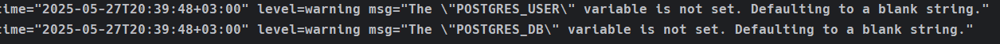
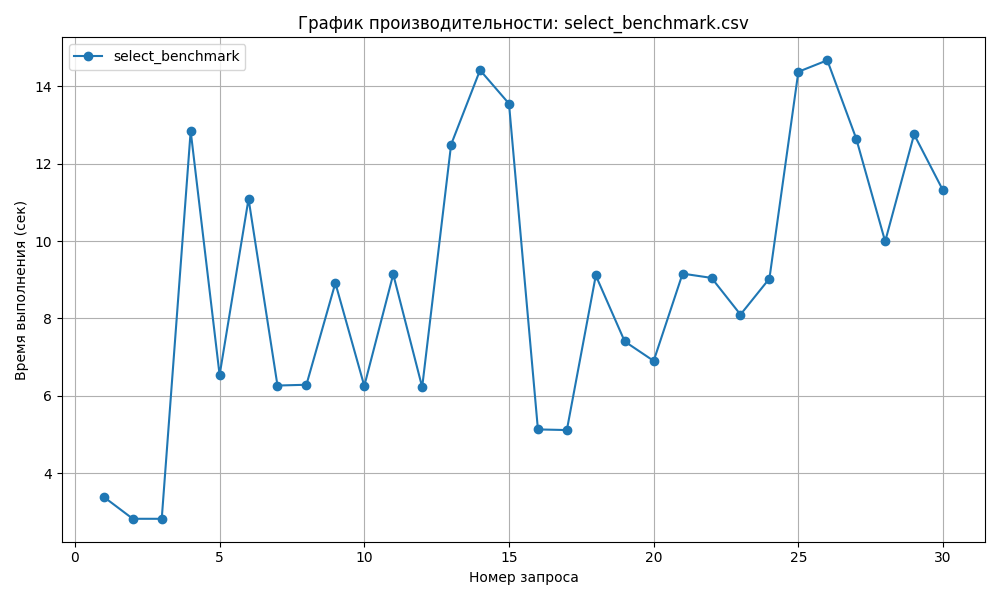
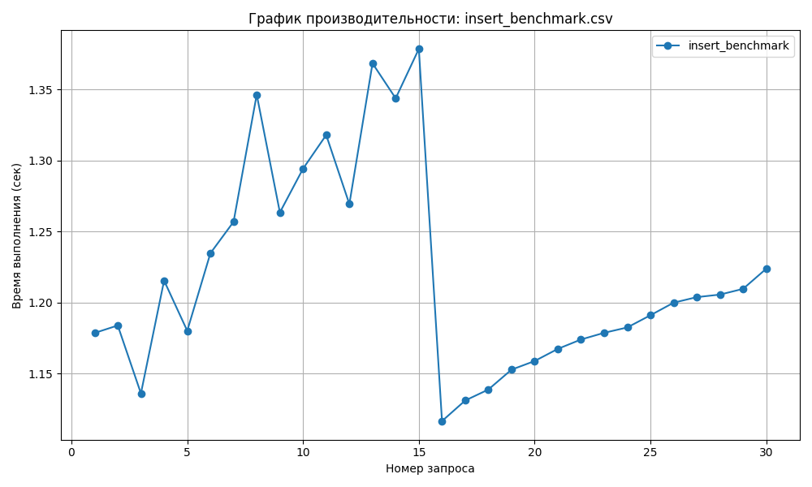
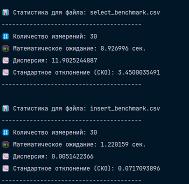

# Замерить скорость выборки и модификации данных в таблице `istudents.mark`

### Настройка проекта

> [!IMPORTANT]
> Перед выполнением данного задания выполните следующие шаги:
> - создайте `.env` файл, скопировав значения [отсюда](.env.example).
> - запустите `Docker Desktop` или аналогичный софт для запуска демона `Docker`
> - перенесите бэкап базы данных в [данную директорию](scripts/restore)

Для запуска БД все также используем старую и добрую команду:

```bash
docker compose up
```

Данного предупреждения не бойтесь, это идет от контейнера `restore`, который прогоняет бэкап:



> [!NOTE]
> В терминале вы должны открыть текущую директорию, где находится данный `README.md`

Теперь нам нужно создать `Python` проект из моих исходников. Для этого вам нужно скачать `uv`.

```bash
pip install uv
```

Или же можно через `curl`:

```bash
curl -LsSf https://astral.sh/uv/install.sh | sh
```

После этого делаете вот так и у вас все зависимости установлены:

```bash
uv sync
```

Теперь активируйте виртуальное окружение. Например, в случае `Windows` вот так вбейте в терминал,
находясь в текущей директории:

```bash
./venv/Scripts/Activate
```

### Выполнить выборку данных (30 раз с различными условиями, фильтрация по полю
`tmark_fk` - условия могут циклически повторяться) - замерить время - получим ряд `t1`.

Запустите [данный файл](app/main.py), после этого выберите пункт "a" и все.
У вас появится директория на уровне `app` - `perfomance`, в которой будет файл `select_benchmark.csv`

### Выполнить вставку данных (30 раз различные данные) - замерить время. Получить ряд `t2`.

Запустите [данный файл](app/main.py), после этого выберите пункт "b" и все.
У вас появится директория на уровне `app` - `perfomance`, в которой будет файл `insert_benchmark.csv`

### Измерения `t1`, `t2` представить на графиках - объяснить их форму;

В результате измерений для получения данных (`SELECT`) получился вот такой график, который представлен ниже:



> [!NOTE]
> Почему же он настолько "прыгающий"?
> Все дело в том, что база данных кэширует запросы на своей стороне, поэтому в некоторых запросах мы просто попадаем в
> кэш и результат быстро возвращается.

В результате измерений для вставки данных (`INSERT`) получился вот такой график, который представлен ниже:



> [!NOTE]
> Почему же идет на вырост, а потом на спад?
> Причина - Конкуренция транзакций. Я использую асинхронные запросы, которые выполняются параллельно.
> Это может привести к следующим проблемам:
> - Блокировки: Если несколько вставок пытаются модифицировать одну и ту же таблицу или строки, `PostgreSQL` может
    блокировать некоторые запросы, пока другие завершаются. Это вызывает "простой" и увеличивает время выполнения.
> - `Contention` на ресурсы: Параллельные запросы конкурируют за CPU, память и I/O дисков. Это особенно заметно на
    слабых машинах или в `Docker`-контейнерах с ограниченными ресурсами.

> [!NOTE]
> Как же избежать такой проблемы?
> Использовать одну общую транзакцию для вставки, что будет эффективнее, чем множество мелких транзакций

### Для полученных рядов (`t1`,
`t2`) посчитать основные статистические показатели - мат. ожидание, дисперсию, СКО и оценить полученные результаты.

У меня вышло такое, как представлено на фото, ниже:

