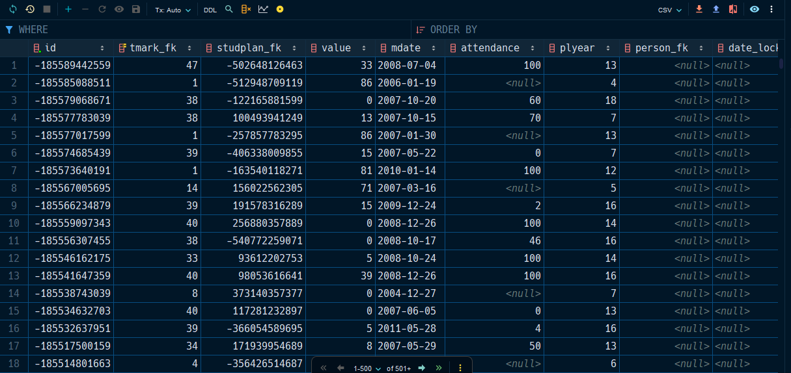
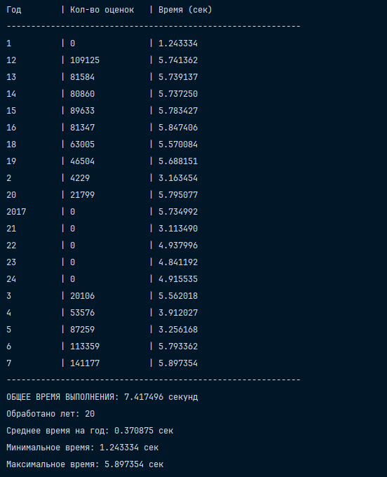
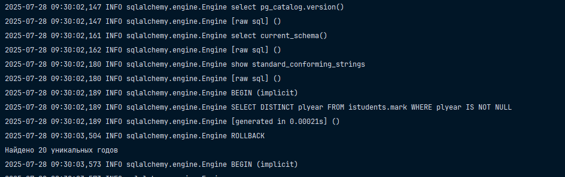
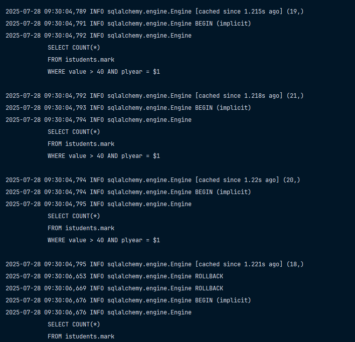

# Написать приложение, которое для каждого значения атрибута «год действия плана» (атрибут `plyear` в таблице `mark`) считает количество положительных оценок в таблице (положительными считаются оценки у которых (`bal`>40). 

## Алгоритм для выполнения задания: 

- Выбор всех возможных значений атрибута `plyear` из таблицы (например, с помощью запроса `SELECT DISTINCT plyear FROM istudents.mark`);
- Организовать цикл по результатам запроса из прошлого пункта и для каждого значения `plyear` независимо считать количество положительных оценок (например, с помощью запроса `SELECT count(id) FROM istudents.mark WHERE bal > 40 and plyear = 1`);
- Вывести полученные данные (по каждому значению `plyear`) пользователю, вывести время, за которое значения были получены.

### Установка приложения

1. Скопируйте значения из `.env.example` в файл `.env` (создайте его сами вручную просто). 
2. Скопируйте файл бэкапа в `scripts/restore`. 
3. Запустите `Docker Desktop` или аналогичное что-нибудь.
4. `docker compose up`. 
5. Создайте и активируйте виртуальное окружение для `Python` с названием `.venv`. 
6. После этого выполните в терминале команду `pip install uv`. 
7. Установите зависимости, используя `uv sync`.

> [!IMPORTANT]
> В условии сказано, что нужно делать условие по полю (`bal`), но такого поля нет в базе данных. 
> Я увидел от старшего курса, что они использовали вместо этого поле `value`. 

> [!NOTE]
> Для запуска приложения используется файл `main.py`

### Выполнение задания

У меня вот вышло примерно такое вот, все представлено на рисунке ниже: 

