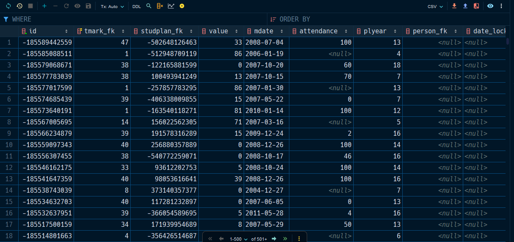
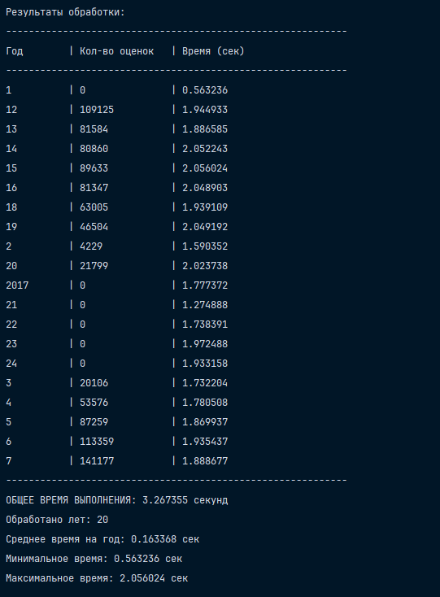
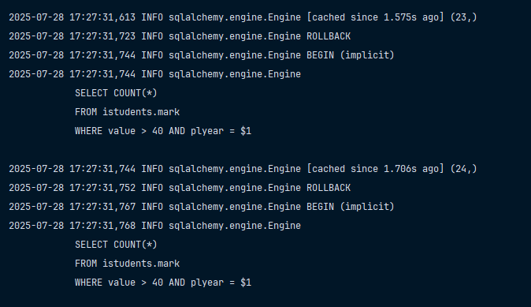
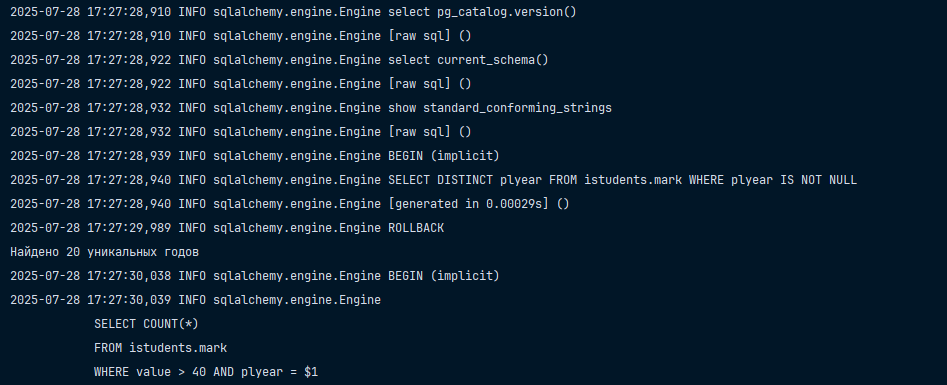

# Создать индекс по полю `plyear` и повторить действия, описанные в п.6 – сравнить полученные временные показатели и результаты;

> [!IMPORTANT]
> В принципе при установке ничего не меняется с прошлого задания. 
> На всякий случай продублирую здесь мануал. 

### Установка приложения

1. Скопируйте значения из `.env.example` в файл `.env` (создайте его сами вручную просто). 
2. Скопируйте файл бэкапа в `scripts/restore`. 
3. Запустите `Docker Desktop` или аналогичное что-нибудь.
4. `docker compose up`. 
5. Создайте и активируйте виртуальное окружение для `Python` с названием `.venv`. 
6. После этого выполните в терминале команду `pip install uv`. 
7. Установите зависимости, используя `uv sync`.

> [!IMPORTANT]
> В условии сказано, что нужно делать условие по полю (`bal`), но такого поля нет в базе данных. 
> Я увидел от старшего курса, что они использовали вместо этого поле `value`. 



> [!NOTE]
> Для запуска приложения используется файл `main.py`.

### Выполнение задания

Для создания индекса я использовал скрипт, который выглядит так, как представлено ниже: 

```sql
CREATE INDEX IF NOT EXISTS idx_plyear ON istudents.mark(plyear);
```

У меня вот вышло примерно такое вот, все представлено на рисунке ниже: 





