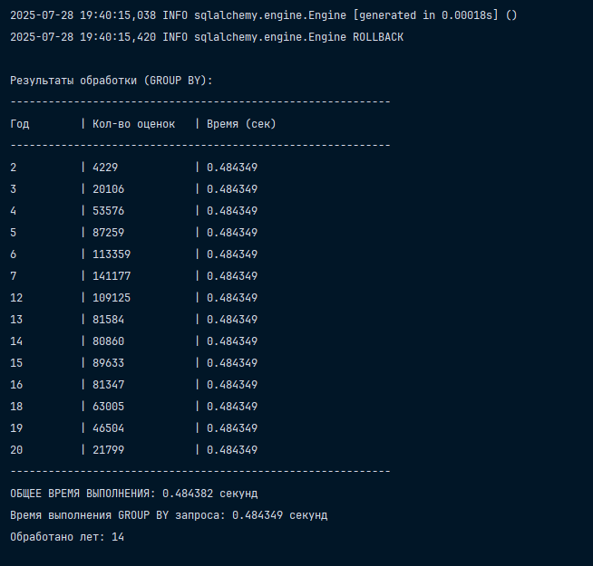
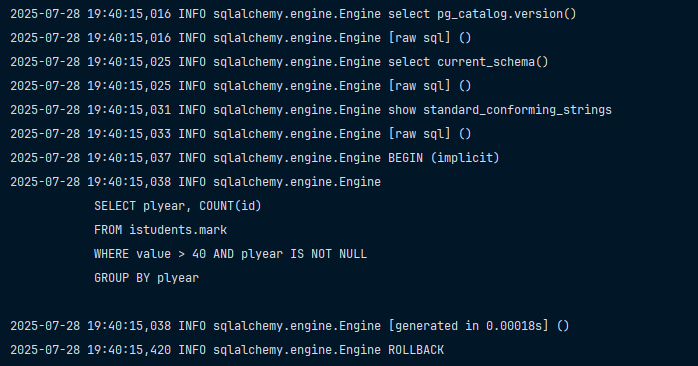

# Написать приложение, которое для каждого значения атрибута «год действия плана» (атрибут `plyear` в таблице `mark`) считает количество положительных оценок в таблице (положительными считаются оценки у которых (`bal`>40). При этом должен быть реализован следующий алгоритм:

## Алгоритм выполнения задания

- Выполнить запрос с группировкой по полю `plyear` для расчета значений по каждой группе (`SELECT plyear, count(id) FROM istudents.mark WHERE bal>40 GROUP BY plyear`);
- Полученные данные и время их получения представить пользователю, сравнить эти показатели с результатами, полученными в п.6, 7;

В принципе установка от прошлых заданий не отличается. Разница, которая вышла при 1 запросе с `GROUP BY`

