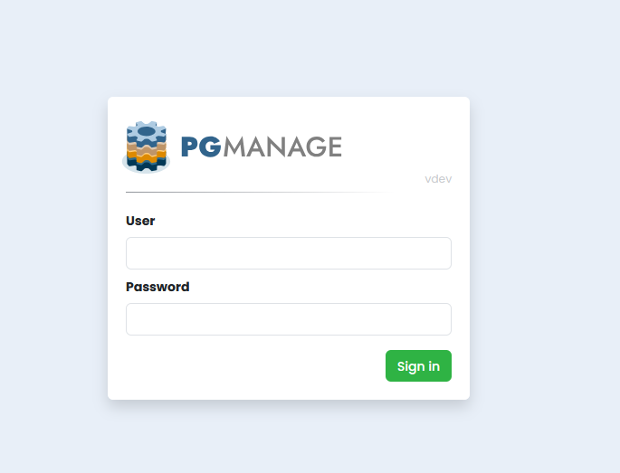
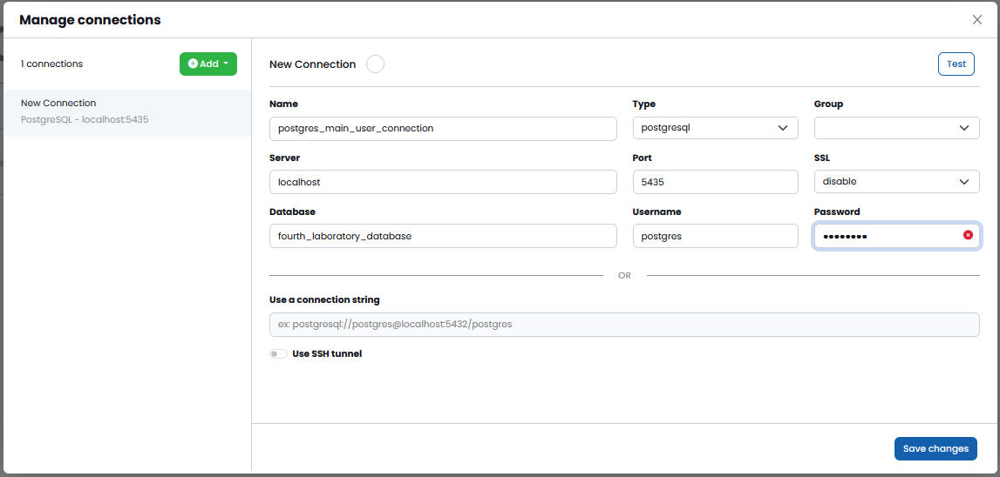
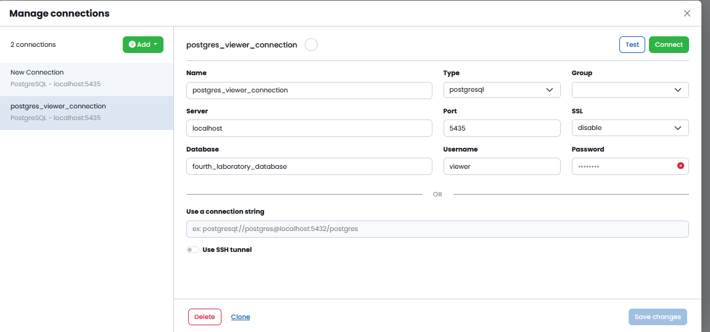
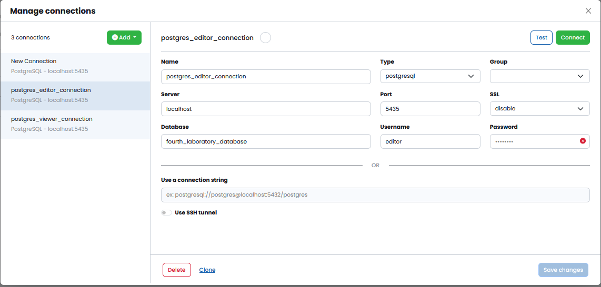

# 4 лабораторная работа

> [!IMPORTANT]
> Для запуска лабораторной работы вам нужно иметь на ПК следующие зависимости:
> - `Docker`
> - `Python 3.11`
> - `NodeJS 18.x`

### Установка и запуск приложения

> [!NOTE]
> Автору было лень заворачивать `front` и `backend` в `Docker`, так что простите, но запуск будет сложнее.

1. Запуск `Docker`

Создайте файл `.env`, скопировав значения из `.env.example`. 

Теперь находясь в данной директории, где лежит данный `README.md` выполните команду, которая представлена ниже: 

```bash
docker compose up --build
```

> [!NOTE]
> Перед запуском на `Windows` убедитесь, что у вас запущен `Docker Desktop`.

2. Запуск `frontend`

Для запуска `frontend` нужно перейти в директорию `pgmanage/app/static/pgmanage_frontend/` с помощью командной строки. 
Находясь в нужной директории выполните команду, которая представлена ниже: 

```bash
npm install
```

Теперь остается только запустить фронт:

```bash
npm run dev
```

3. Запуск `backend` приложения

Создайте виртуальное окружение `Python`, используя `CLI` или `Pycharm`. 

Теперь вам нужно установить `poetry`: 

```bash
pip install poetry
```

Теперь установим все зависимости: 

```bash
poetry install
```

Теперь нам нужно перейти в директорию `pgmanage`:

```bash
cd pgmanage
```

Теперь запускаем приложение первый раз. 

> [!NOTE]
> Это мы запускаем первый раз, чтобы создалась `sqlite` база данных, которая будет хранить наши учетки. 
> После этого надо будет выключить приложение и прогнать миграции. 

```bash
python manage.py runserver
```

Командой в терминале `CTRL` + `C` отменяем приложение, если вам вылетел `ERROR` по поводу того, что миграции не применены. 
Теперь прогоним миграции, если была жалоба:

```bash
python manage.py migrate
```

Теперь запустим заново приложение, используя команду: 

```bash
python manage.py runserver
```

### Выполнение работы

#### Открытие `WebUI`

Перейдите в браузере на адрес: `http://localhost:8000`. У вас появится окошко, как представлено на рисунке ниже:



Теперь введите следующие данные:

- `login`: `admin`
- `password`: `admin`

#### Подключение пользователей к базе данных

##### Подключение для админа - `postgres`

Я здесь использую данные из `.env`.



##### Подключение для `viewer`



> [!NOTE]
> Логин для `viewer`: `viewer`
> Пароль: `read_only_pass`

##### Подключение для `editor`



> [!NOTE]
> Логин для `editor`: `editor`
> Пароль: `edit_pass`

#### Просмотр таблиц