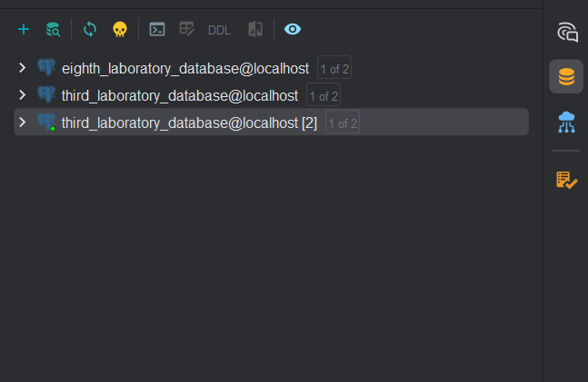
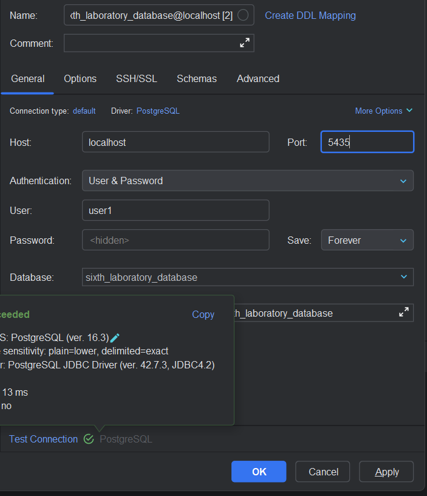
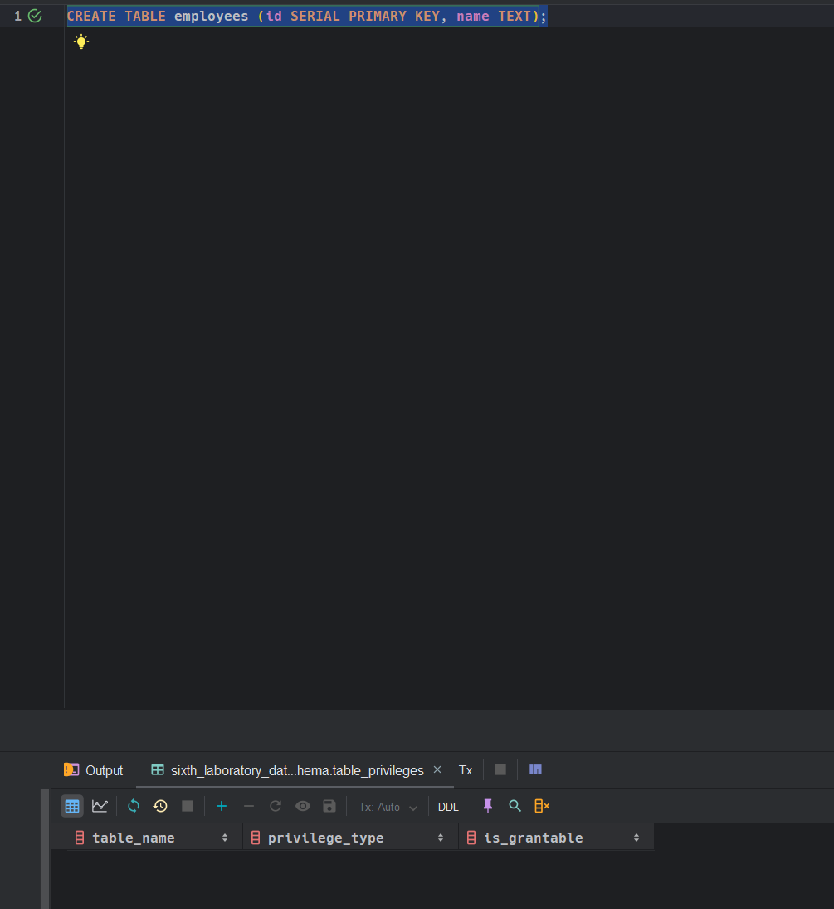
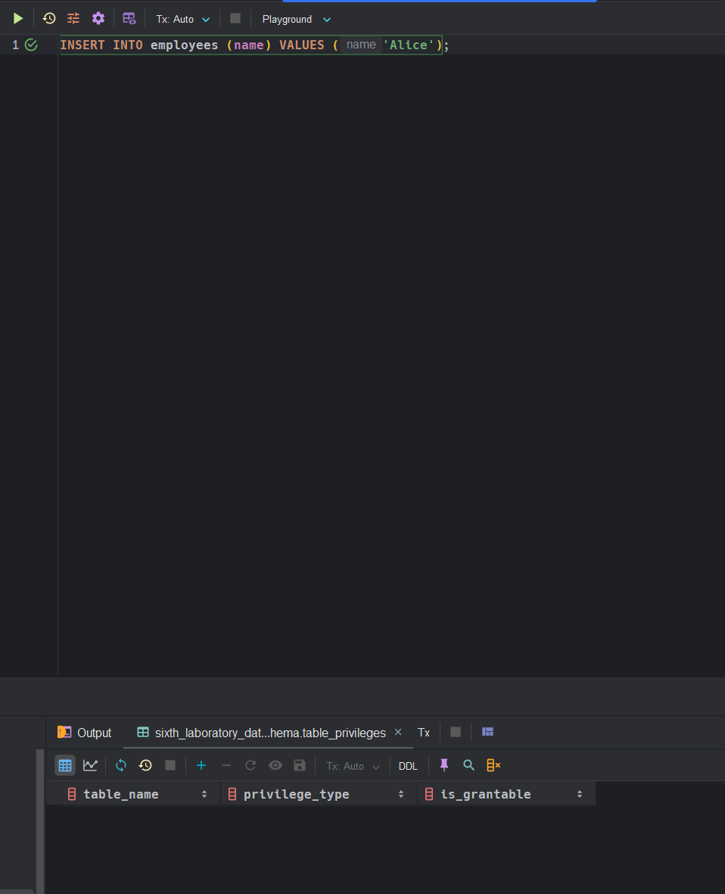
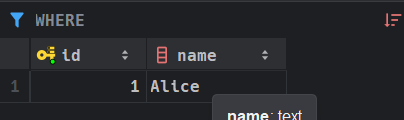
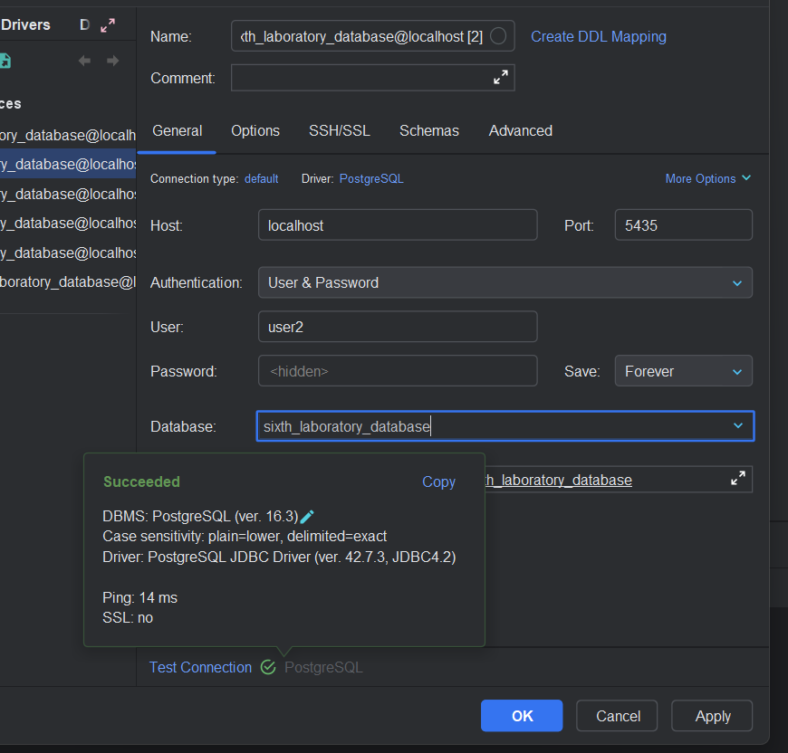
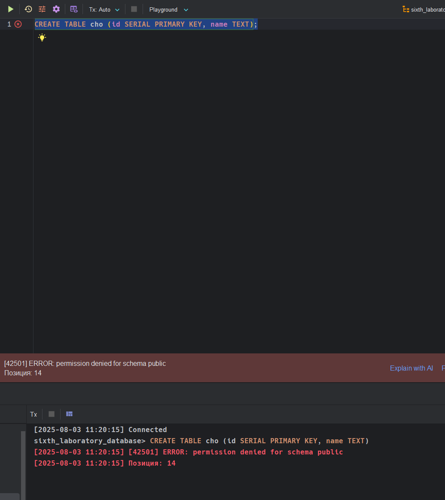

# 1 задание. Создать несколько пользователей, продемонстрировать назначение им различных привилегий (на создание объектов БД, на просмотр и изменение).

### Создание пользователей

```sql
-- Создаем пользователей
CREATE USER user1 WITH PASSWORD 'pass1';
CREATE USER user2 WITH PASSWORD 'pass2';
```

> [!NOTE]
> - Вручную выполнять не надо, это прокидывается в `Docker` контейнер автоматически.
> - Здесь создаются пользователи с паролями, которые были заданы. 

### Предоставление права на `user1`

```sql
-- Предоставляем права user1
GRANT CREATE ON DATABASE sixth_laboratory_database TO user1; -- Право создавать объекты в БД
GRANT CREATE, USAGE ON SCHEMA public TO user1;
GRANT SELECT, INSERT ON ALL TABLES IN SCHEMA public TO user1; -- Чтение/запись таблиц
```

> [!NOTE]
> - Вручную выполнять не надо, это прокидывается в `Docker` контейнер автоматически.
> - Создание объектов в базе данных. Это равносильно полным правам на все привилегии на таблицы, которые он создал.  
> - Также я дал доступ на чтение и запись из других таблиц.

### Предоставление права на `user2`

```sql
-- Предоставляем права user2
GRANT CONNECT ON DATABASE sixth_laboratory_database TO user2; -- Только подключение к БД
GRANT USAGE ON SCHEMA public TO user2;
GRANT SELECT ON ALL TABLES IN SCHEMA public TO user2; -- Только чтение таблиц
```

> [!NOTE]
> - Вручную выполнять не надо, это прокидывается в `Docker` контейнер автоматически.
> - Мы задали разрешение только на подключение к базе данных, но запретили делать создание объектов и т.п.
> - Разрешили делать просмотр всех таблиц. 

### Как сделать проверку прав на `user1`?

#### CLI

Мы должны подключиться к контейнеру, а потом уже к самому `PostgreSQL`. 

Для подключения к контейнеру нужно выполнить команду, которая представлена ниже: 

```bash
docker exec -it postgres-lab-6 /bin/bash
```

Теперь подключаемся к базе данных для выполнения действий:

```bash
psql -h localhost -p 5432 -U user1 -d sixth_laboratory_database
```

> [!NOTE]
> Название базы взяты из `.env`.

После ввода он попросит ввести пароль, нужно ввести: `pass1`

Попробуем теперь от имени пользователя `user1` создать таблицу: 

```sql
CREATE TABLE employees (id SERIAL PRIMARY KEY, name TEXT);
```

> [!NOTE]
> Все должно сработать.

Попробуем вставить данные теперь:

```sql
INSERT INTO employees (name) VALUES ('Alice');
```

> [!NOTE]
> Все должно сработать.

#### Pycharm Professional

Нажимаем на кнопку базы данных по правой части интерфейса, посмотрите внимательно на рисунке ниже. 



Теперь нужно создать подключение для `user1`, выполните практически то же самое, как представлено на фото ниже:



Попробуем теперь создать таблицу, выполнение команды представлено на фото ниже: 



Попробуем теперь вставить данные от имени `user1`, все можете увидеть на фото ниже: 



Видим, что все появилось в таблице: 



### Как сделать проверку прав на `user2`?

Мы должны подключиться к контейнеру, а потом уже к самому `PostgreSQL`. 

#### CLI 

Для подключения к контейнеру нужно выполнить команду, которая представлена ниже: 

```bash
docker exec -it postgres-lab-6 /bin/bash
```

Теперь подключаемся к базе данных для выполнения действий:

```bash
psql -h localhost -p 5432 -U user2 -d sixth_laboratory_database
```

> [!NOTE]
> Название базы взяты из `.env`.

После ввода он попросит ввести пароль, нужно ввести: `pass2`

Попробуем теперь от имени пользователя `user2` создать таблицу: 

```sql
CREATE TABLE cho (id SERIAL PRIMARY KEY, name TEXT);
```

> [!NOTE]
> Permission denied

#### Pycharm Professional

Нажимаем на кнопку базы данных по правой части интерфейса, посмотрите внимательно на рисунке ниже. 


Теперь нужно создать подключение для `user2`, выполните практически то же самое, как представлено на фото ниже:



Попробуем теперь создать таблицу, выполнение команды представлено на фото ниже: 



