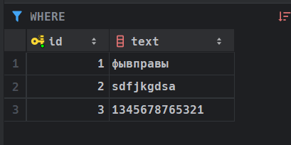
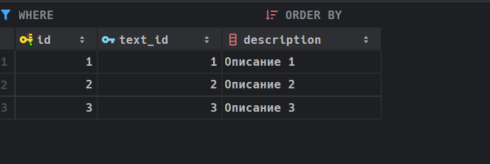
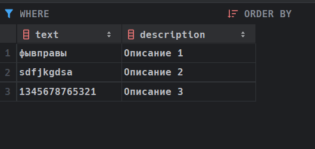
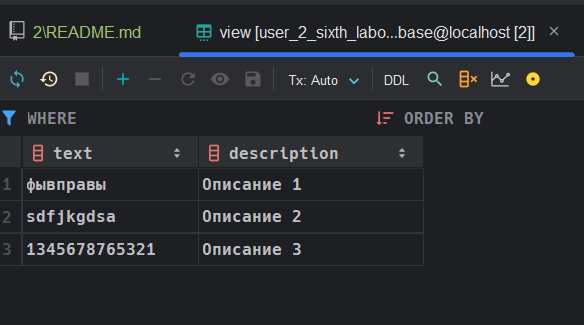

# 2.  Создать от имени одного из пользователей таблицы, реализовать на их базе представление и предоставить права на просмотр и изменение данных в представлении другому пользователю. Объяснить результаты.)

Зайдите под пользователем `user1`, после этого в терминале выполните команды, которые представлены ниже: 

```sql
create table if not exists table1(
	id serial primary key,
	text varchar(50)
);
```

```sql
create table if not exists table2(
	id serial primary key,
	text_id integer,
	description varchar(100),
	foreign key (text_id) references table1(id) on delete cascade on update cascade
);
```

Заполним `table1` данными: 

```sql
insert into table1 (text) values ('фывправы'), ('sdfjkgdsa'), ('1345678765321');
```



Заполним `table2` данными:

```sql
insert into table2(text_id, description) values (1, 'Описание 1'), (2, 'Описание 2'), (3, 'Описание 3');
```



Для создания представления выполните команды, которая представлена ниже: 

```sql
create view View as
select t1.text, t2.description
from table1 as t1
inner join table2 as t2
on t2.text_id = t1.id;
```



Выдадим права пользователю `user2`:

```sql
grant select on View to user2;
```

Проверим, что пользователь `user1` полностью видит свои данные: 


Проверим, что пользователь `user2` полностью видит данные в `View`:



Но данные с таблиц пользователь `user2` просматривать не может: 


