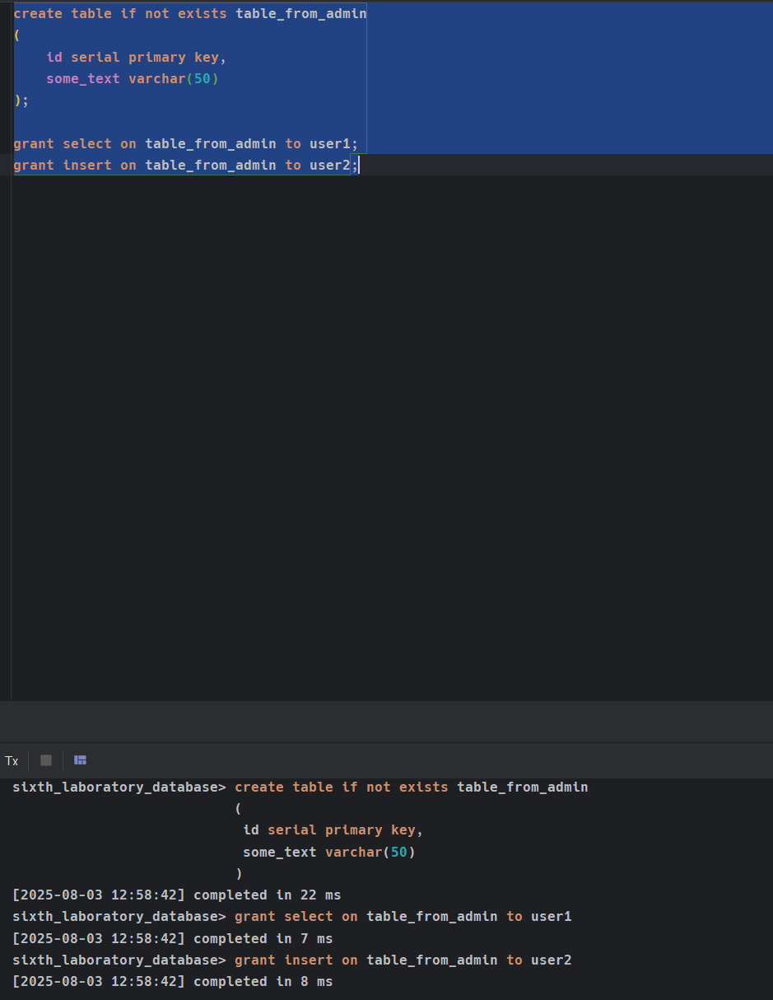

# Создать от имени администратора (или пользователя, обладающего достаточными привилегиями) несколько таблиц в БД. 

Подключитесь к базе данных из-под пользователя `postgres`.

> [!NOTE]
> Пароль для пользователя `postgres` задан в `.env`. 

Выполните команды, которые представлены ниже:

```sql
create table if not exists table_from_admin
(
	id serial primary key,
	some_text varchar(50)
);
```


