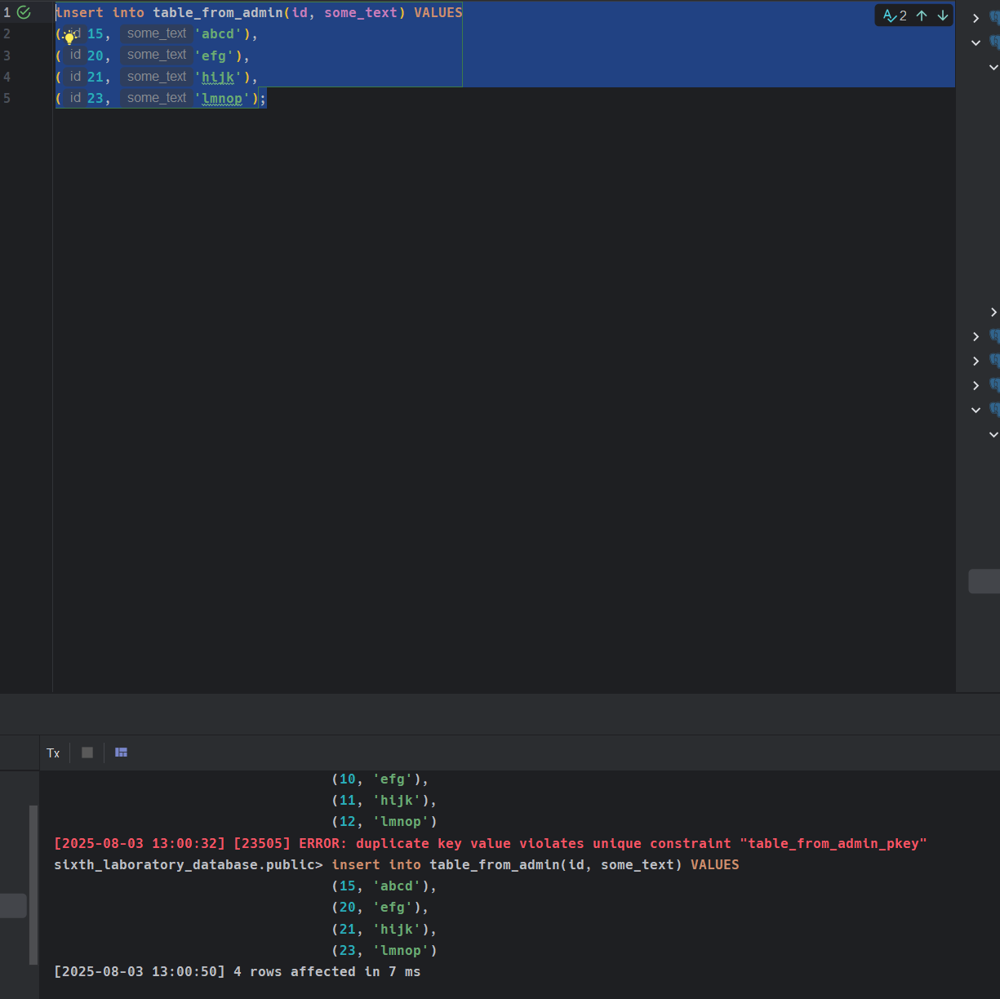
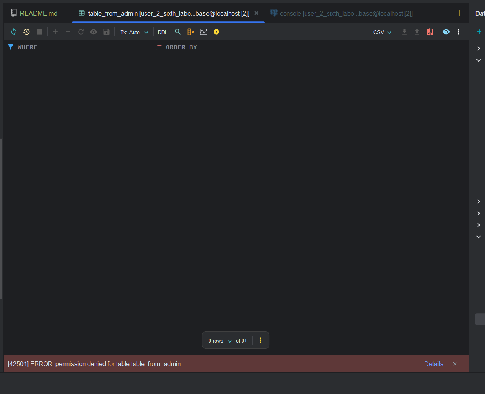
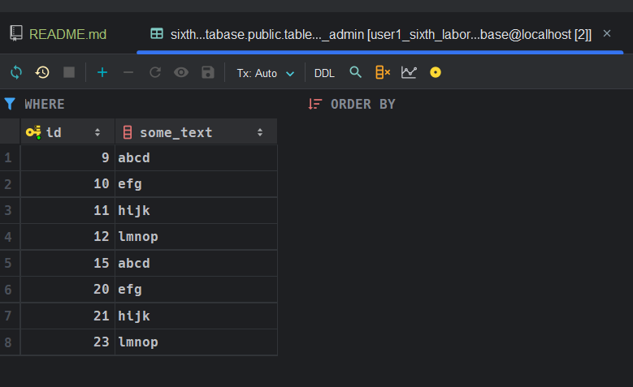
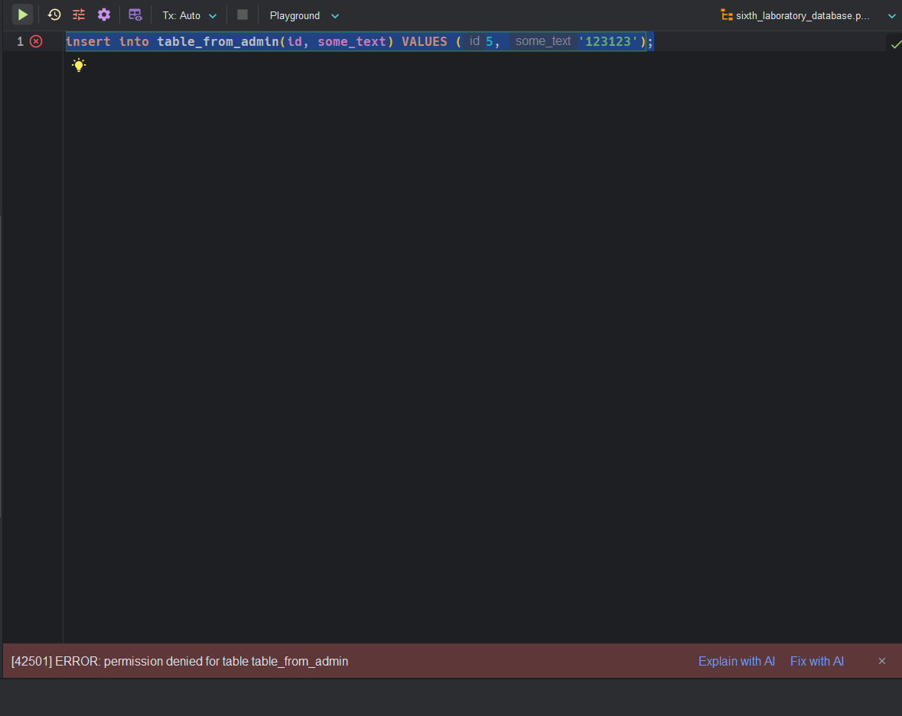

# Предоставить различным ролям различные привилегии (на выборку и модификацию) к созданным таблицам и продемонстрировать механизм разрешения использования ролей в рамках сеанса конкретного пользователя.

Подключитесь к базе данных из-под пользователя `postgres` и выполните команды, которые представлены ниже:

```sql
grant select on table_from_admin to user1;
grant insert on table_from_admin to user2;
```

Теперь подключитесь к базе данных из-под пользователя `user2` и выполните запрос, который представлен ниже:

```sql
insert into table_from_admin(id, some_text) VALUES
(9, 'abcd'),
(10, 'efg'),
(11, 'hijk'),
(12, 'lmnop');
```



Проверим, что `user2` не может просматривать содержимое: 



Теперь подключаемся к базе данных из-под пользователя `user1` и проверим, что он видит содержимое: 



Попробуем теперь вставить данные из-под пользователя `user1`:

```sql
insert into table_from_admin(id, some_text) VALUES (5, '123123');
```

