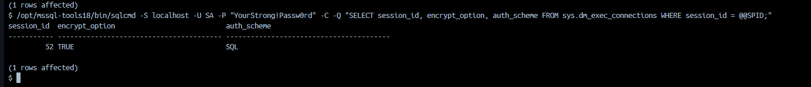
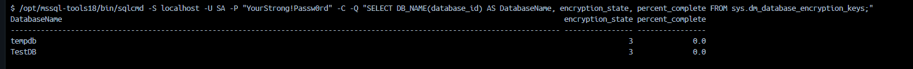
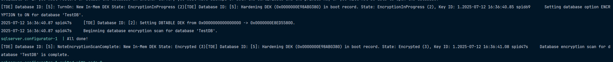
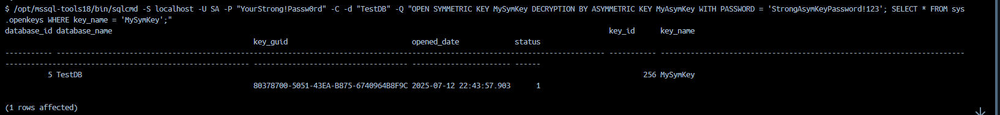
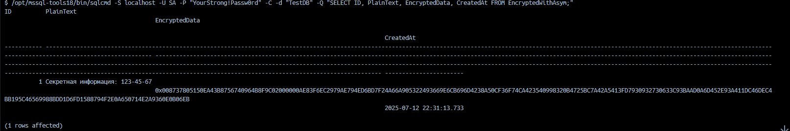
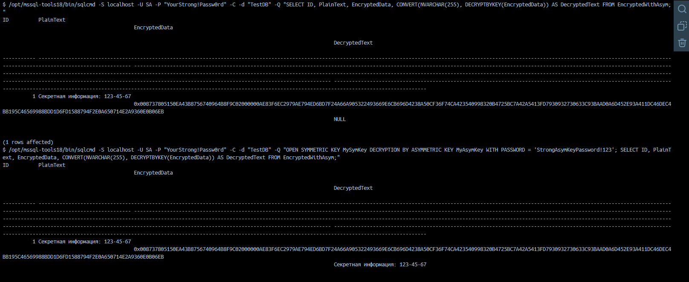

# Лабораторная работа 7

> [!NOTE]
> Для выполнения лабораторной работы вам нужен `Docker`.
> Также нужно создать `.env` файл, скопировав значения из `.env.example`. 


### Включить шифрование соединений в ядре СУБД `SQL Server` и описать алгоритм

Проверим, что шифрование канала включено. Для этого используем команду, которая представлена ниже: 

```bash
/opt/mssql-tools18/bin/sqlcmd -S localhost -U SA -P "YourStrong!Passw0rd" -C -Q "SELECT session_id, encrypt_option, auth_scheme FROM sys.dm_exec_connections WHERE session_id = @@SPID;"
```



> [!NOTE]
> Из особенностей: `MS SQL` в случае указания forceencryption в 1 сам генерирует сертификаты.
> По логам нашел, используя команду: `cat /var/opt/mssql/log/errorlog | grep -i "encryption"`

> [!NOTE]
> В случае `MS SQL`, если даже генерировать собственные сертификаты с помощью скриптов, то он тоже будет
> ругаться, если не указывать флаг `-C`, без него у вас просто не будет работать, если нет СА официального. 


### Включить прозрачное шифрование данных и описать каждый шаг алгоритма

В моем случае инициализация прозрачного шифрования происходит в файле `1.sql`, она применяется автоматически при запуске
`Docker` контейнера. 

Для запроса из-под консоли `Docker`:

```bash
/opt/mssql-tools18/bin/sqlcmd -S localhost -U SA -P "YourStrong!Passw0rd" -C -Q "SELECT DB_NAME(database_id) AS DatabaseName, encryption_state, percent_complete FROM sys.dm_database_encryption_keys;"
```





### Cоздать таблицу в БД и реализовать процедуру (или процедуры) на языке `T-SQL`, которые предоставляют возможности внесения и получения данных, хранящихся в зашифрованном виде (`SELECT` вернет зашифрованные данные) с использованием `EncryptByPassPhrase`/`DecryptByPassPhrase`

Проверяем какие есть таблицы: 

```bash
/opt/mssql-tools18/bin/sqlcmd -S localhost -U SA -P "YourStrong!Passw0rd" -C -d "TestDB" -Q "SELECT TABLE_NAME FROM INFORMATION_SCHEMA.TABLES WHERE TABLE_TYPE = 'BASE TABLE'"
```

Вставляем тестовые данные: 

```bash
/opt/mssql-tools18/bin/sqlcmd -S localhost -U SA -P "YourStrong!Passw0rd" -C -d "TestDB" -Q "EXEC InsertEncryptedSecret @SecretName = 'Password admin', @PlainText = 'Qwerty123!';"
```

```bash
/opt/mssql-tools18/bin/sqlcmd -S localhost -U SA -P "YourStrong!Passw0rd" -C -d "TestDB" -Q "EXEC InsertEncryptedSecret @SecretName = 'Bank card', @PlainText = '1234-5678-9012-3456';"
```

```bash
/opt/mssql-tools18/bin/sqlcmd -S localhost -U SA -P "YourStrong!Passw0rd" -C -d "TestDB" -Q "EXEC InsertEncryptedSecret @SecretName = 'Personal data', @PlainText = 'Grishkov Egor Alexeevich';"
```

Получаем данные в зашифрованном виде (как требует задание):

```bash
/opt/mssql-tools18/bin/sqlcmd -S localhost -U SA -P "YourStrong!Passw0rd" -C -d "TestDB" -Q "EXEC GetEncryptedSecrets;"
```

Проверяем дешифровку (для демонстрации):

```bash
/opt/mssql-tools18/bin/sqlcmd -S localhost -U SA -P "YourStrong!Passw0rd" -C -d "TestDB" -Q "EXEC DecryptSecret @SecretID = 1;"
```

Дополнительная проверка: попробуем расшифровать с неправильным паролем:

```bash
/opt/mssql-tools18/bin/sqlcmd -S localhost -U SA -P "YourStrong!Passw0rd" -C -d "TestDB" -Q "SELECT ID, SecretName, CONVERT(NVARCHAR(MAX), DECRYPTBYPASSPHRASE('WrongPassword!', EncryptedData)) AS FailedDecryption FROM EncryptedSecrets;"
```

### Продемонстрировать процесс шифрования данных с использованием симметричного ключа, зашифрованного с помощью ассиметричного ключа (написать скрипт)

#### Создать ассиметричный ключ и зашифровать его парольной фразой

В моем случае создание ключей происходит автоматически при инициализации базы данных. 
Для проверки того, что ассиметричный существует можно использовать команду, которая представлена ниже: 

```bash
/opt/mssql-tools18/bin/sqlcmd -S localhost -U SA -P "YourStrong!Passw0rd" -C -d "TestDB" -Q "SELECT name, algorithm_desc, key_length, pvt_key_encryption_type_desc FROM sys.asymmetric_keys WHERE name = 'MyAsymKey';"
```

> [!NOTE]
> В сыром виде `SQL` запрос выглядит так, как представлено ниже

```sql
SELECT 
    name, 
    algorithm_desc, 
    key_length,
    pvt_key_encryption_type_desc
FROM sys.asymmetric_keys
WHERE name = 'MyAsymKey';
```

#### Создать симметричный ключ и зашифровать его с помощью ассиметричного ключа

Симметричный ключ у меня автоматически создается при инициализации `Docker` контейнера.
Его существование можно проверить, используя команду, которая представлена ниже:

```bash
/opt/mssql-tools18/bin/sqlcmd -S localhost -U SA -P "YourStrong!Passw0rd" -C -d "TestDB" -Q "SELECT name, algorithm_desc, key_length, key_guid FROM sys.symmetric_keys WHERE name = 'MySymKey';";
```

> [!NOTE]
> В сыром виде `SQL` запрос выглядит так, как представлено ниже

```bash
SELECT 
    name, 
    algorithm_desc, 
    key_length,
    key_guid
FROM sys.symmetric_keys
WHERE name = 'MySymKey';
```

Попробуем теперь открыть симметричный ключ, используя команду, которая представлена ниже: 

```bash
/opt/mssql-tools18/bin/sqlcmd -S localhost -U SA -P "YourStrong!Passw0rd" -C -d "TestDB" -Q "OPEN SYMMETRIC KEY MySymKey DECRYPTION BY ASYMMETRIC KEY MyAsymKey WITH PASSWORD = 'StrongAsymKeyPassword!123';"
```

> [!NOTE]
> В сыром виде `SQL` запрос выглядит так, как представлено ниже

```sql
OPEN SYMMETRIC KEY MySymKey
    DECRYPTION BY ASYMMETRIC KEY MyAsymKey
    WITH PASSWORD = 'StrongAsymKeyPassword!123';
```

#### Убедиться, что ключ открыт

Для убеждения воспользуемся командой, которая представлена ниже: 

```bash
/opt/mssql-tools18/bin/sqlcmd -S localhost -U SA -P "YourStrong!Passw0rd" -C -d "TestDB" -Q "OPEN SYMMETRIC KEY MySymKey DECRYPTION BY ASYMMETRIC KEY MyAsymKey WITH PASSWORD = 'StrongAsymKeyPassword!123'; SELECT * FROM sys.openkeys WHERE key_name = 'MySymKey';"
```



> [!NOTE]
> В сыром виде запрос выглядит так, как представлено ниже

```sql
SELECT 
    name, 
    is_open,
    key_algorithm,
    key_length
FROM sys.openkeys
WHERE key_name = 'MySymKey';
```

#### Внести шифрованные данные в таблицу

В базе данных у меня уже были вставлены данные, попробуем просмотреть какие данные вообще есть без декодирования: 

```bash
/opt/mssql-tools18/bin/sqlcmd -S localhost -U SA -P "YourStrong!Passw0rd" -C -d "TestDB" -Q "SELECT ID, PlainText, EncryptedData, CreatedAt FROM EncryptedWithAsym;"
```



> [!NOTE]
> В сыром виде `sql` запрос выглядит так, как представлено ниже:

```sql
SELECT 
    ID,
    PlainText,
    EncryptedData,
    CreatedAt
FROM EncryptedWithAsym;
```

Для демонстрации расшифровки используем команду, которая представлена ниже: 

```bash
/opt/mssql-tools18/bin/sqlcmd -S localhost -U SA -P "YourStrong!Passw0rd" -C -d "TestDB" -Q "OPEN SYMMETRIC KEY MySymKey DECRYPTION BY ASYMMETRIC KEY MyAsymKey WITH PASSWORD = 'StrongAsymKeyPassword!123'; SELECT ID, PlainText, EncryptedData, CONVERT(NVARCHAR(255), DECRYPTBYKEY(EncryptedData)) AS DecryptedText FROM EncryptedWithAsym;"
```



> [!NOTE]
> В сыром виде `SQL` запрос выглядит, как представлено ниже

```sql
SELECT 
    ID,
    PlainText,
    EncryptedData,
    CONVERT(NVARCHAR(255), DECRYPTBYKEY(EncryptedData)) AS DecryptedText
FROM EncryptedWithAsym;
```

