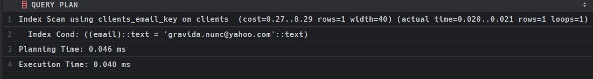

# B tree индекс

Для проверки на целостность используем команду, которая представлена ниже: 

```sql
INSERT INTO clients (email, name) VALUES 
  ('egestas.nunc@icloud.com','Danil Kovalev');
```

Посмотрим, как он ищет с помощью оператора `LIKE`:

```sql
EXPLAIN ANALYZE
SELECT * FROM clients 
WHERE email LIKE 'gravida.nunc@yahoo.com';
```


Теперь попробуем на равенство: 

```sql
EXPLAIN ANALYZE
SELECT * FROM clients 
WHERE email = 'gravida.nunc@yahoo.com';
```

