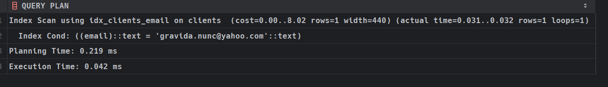

# Hash index

Для проверки на целостность используем команду, которая представлена ниже: 

```sql
INSERT INTO clients (email, name) VALUES 
  ('egestas.nunc@icloud.com','Danil Kovalev');
```

Для проверки скорости здесь можно использовать только оператор `=`

```sql
EXPLAIN ANALYZE
SELECT * FROM clients
WHERE email = 'gravida.nunc@yahoo.com'
```

