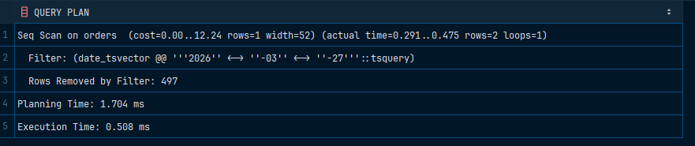

# Gin индекс

Для проверки на целостность используем команду, которая представлена ниже: 

```sql
INSERT INTO clients (email, name) VALUES 
  ('egestas.nunc@icloud.com','Danil Kovalev');
```

```sql
INSERT INTO orders (order_date, client_id) VALUES
('2025-05-09',500)
```

Для тестирования производительности:

```sql
EXPLAIN ANALYZE
SELECT * FROM orders
WHERE date_tsvector @@ to_tsquery('simple', '2026-03-27');
```


