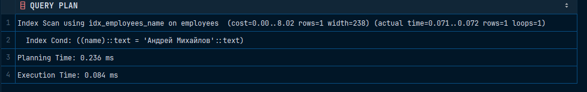

# Hash

Для проверки на консистентность:

```sql
INSERT INTO employees (name, salary)
VALUES ('Алексей Козлов', 70000.00);
```

```sql
INSERT INTO employees (name, salary)
VALUES (NULL, NULL);
```

Для проверки на производительность:

```sql
EXPLAIN ANALYZE SELECT * FROM employees WHERE name = 'Андрей Михайлов';
```


