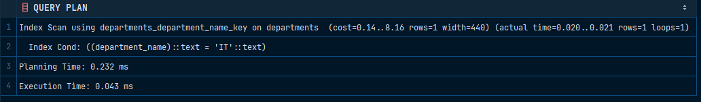

# Gin

Для проверки целостности: 

```sql
INSERT INTO employees (name, salary)
VALUES ('Алексей Козлов', 70000.00);
```

```sql
INSERT INTO employees (name, salary)
VALUES ('Данил Ковалев', -70000.00);
```

```sql
INSERT INTO departments (department_id, department_name, location)
VALUES (1, 'IT', 'Москва');
```

Для измерения производительности можно использовать команду, которая представлена ниже:

```sql
EXPLAIN ANALYZE SELECT * FROM departments WHERE department_name = 'IT';
```



