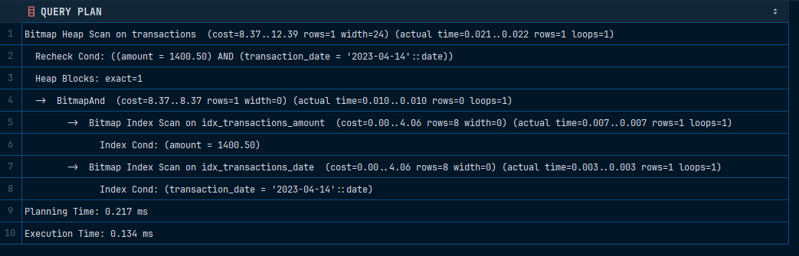

# Hash

Для проверки целостности: 

```sql
INSERT INTO transactions (amount, transaction_date)
VALUES (NULL, NULL);
```

Для измерения производительности можно использовать команду, которая представлена ниже:

```sql
EXPLAIN ANALYZE SELECT * FROM transactions WHERE amount = 1400.50 AND transaction_date = '2023-04-14';
```



