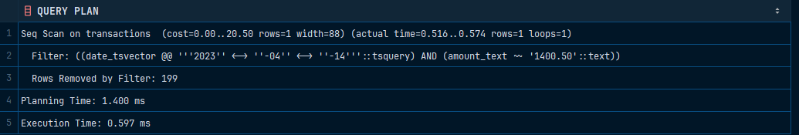

# Gin

Для проверки целостности: 

```sql
INSERT INTO transactions (amount, transaction_date)
VALUES (NULL, NULL);
```

Для проверки производительности

```sql
EXPLAIN ANALYZE 
SELECT * FROM transactions
WHERE date_tsvector @@ to_tsquery('simple', '2023-04-14') AND amount_text LIKE '1400.50';
```


