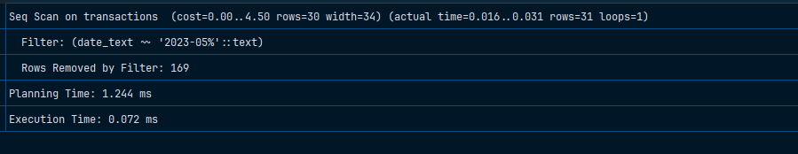

# Gist

Для проверки целостности: 

```sql
INSERT INTO transactions (amount, transaction_date)
VALUES (NULL, NULL);
```

Для проверки производительности:

```sql
EXPLAIN ANALYZE 
SELECT * FROM transactions 
WHERE date_text LIKE '2023-05%';
```



```sql
EXPLAIN ANALYZE 
SELECT * FROM transactions 
WHERE date_text LIKE '2023-05%';
```


