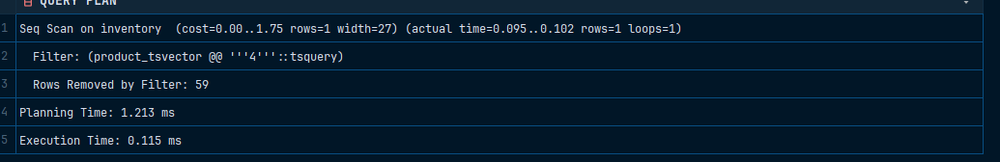

# Gin


Для проверки консистенси можно использовать команды ниже: 

```sql
INSERT INTO products (product_name, price) VALUES ('Смартфон', 25000.000);
```

```sql
INSERT INTO products (product_name, price) VALUES ('Телефон', -25000.000);
```

```sql
INSERT INTO products (product_name, price) VALUES (NULL, NULL);
```

```sql
INSERT INTO inventory (product_id, quantity) VALUES (NULL, NULL);
```

```sql
INSERT INTO inventory (product_id, quantity) VALUES (1, -5);
```

Для проверки производительности:

```sql
EXPLAIN ANALYZE 
SELECT * FROM inventory 
WHERE product_tsvector @@ to_tsquery('simple', '4');
```

