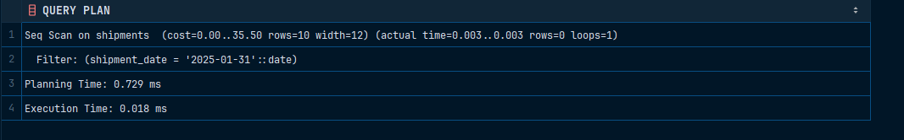

# Brin index

Проверка целостности:

```sql
INSERT INTO clients (email, name) VALUES 
  ('egestas.nunc@icloud.com','Danil Kovalev');
```

```sql
INSERT INTO orders (order_date, client_id) VALUES
('2025-05-09',500)
```

```sql
INSERT INTO shipments (order_id, shipment_date) VALUES                                                    
(NULL, NULL)
```

```sql
INSERT INTO shipments (order_id, shipment_date) VALUES                                                    
(124124214124312, '2026-02-23')
```

Для проверки производительности:

```sql
EXPLAIN ANALYZE
SELECT * FROM shipments
WHERE shipment_date = '2025-01-31';
```


