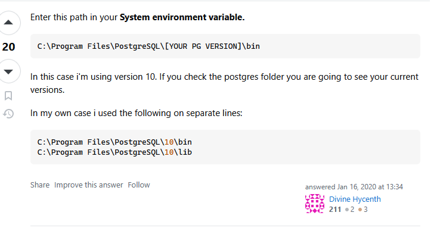

# Вариант 2

Создайте таблицу `payment_records` с полями `payment_id`, `account_number`, и `amount`.
Поле `account_number` зашифруйте с помощью симметричного ключа. Настройте `SSL`-соединение, при
котором клиент должен использовать `sslmode=verify-ca` для подключения.

> [!IMPORTANT]
> Перед запуском скопируйте содержимое `.env.example` в `.env` файл. 
> После этого можете запустить, используя `docker compose up --build`.

> [!NOTE]
> В `IDEA` / `Pycharm` нестабильный драйвер для подключения по `SSL`. 
> В `pgadmin4` нет функционала по подключению через `SSL`.
> Из вариантов - использование только командой строки. 

### Настройка `psql` в Windows

Скачайте клиент `PostgreSQL` с официального сайта, после этого проставьте переменные окружения, как сказано на фото.

Теперь из-под `Windows` `Powershell` можно подключиться, используя команду: 

```bash
psql "host=localhost port=5435 dbname=ninth_laboratory_database_var_2 user=user2 sslmode=verify-ca sslrootcert=certs/ca.pem sslcert=certs/client-cert.pem sslkey=certs/client-key.pem"
```

> [!NOTE]
> Запускать команду для подключения к базе данных нужно из-под текущей директории, где `README.md` 




### Выполнение лабораторной работы

Проверьте наличие данных:

```sql
SELECT payment_id, amount FROM payment_records;
```

Расшифруйте данные (используя созданную функцию):

```sql
SELECT payment_id, decrypt_account(account_number) AS account, amount 
FROM payment_records;
```

Вставьте новую запись: 

```sql
INSERT INTO payment_records (account_number, amount)
VALUES (encrypt_account('40817810500000000003'), 5400.00);
```

Проверьте вставку: 

```sql
SELECT * FROM payment_records;
```

