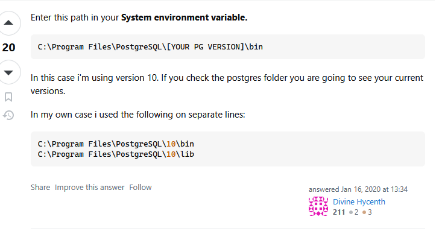

# Вариант 3

Настройте базу данных так, чтобы доступ к таблице `employee_info` был возможен только по `SSL`-соединению с
параметром `sslmode=verify-full`. Поле `salary` в таблице должно храниться в зашифрованном виде и требовать дешифровки при
выборке.

> [!IMPORTANT]
> Перед запуском скопируйте содержимое `.env.example` в `.env` файл. 
> После этого можете запустить, используя `docker compose up --build`.

> [!NOTE]
> В `IDEA` / `Pycharm` нестабильный драйвер для подключения по `SSL`. 
> В `pgadmin4` нет функционала по подключению через `SSL`.
> Из вариантов - использование только командой строки. 

### Настройка `psql` в Windows

Скачайте клиент `PostgreSQL` с официального сайта, после этого проставьте переменные окружения, как сказано на фото.

Теперь из-под `Windows` `Powershell` можно подключиться, используя команду: 

```bash
psql "host=localhost port=5435 dbname=ninth_laboratory_database_var_3 user=user2 sslmode=verify-ca sslrootcert=certs/ca.pem sslcert=certs/client-cert.pem sslkey=certs/client-key.pem"
```

> [!NOTE]
> Запускать команду для подключения к базе данных нужно из-под текущей директории, где `README.md` 



### Выполнение лабораторной работы

Проверьте наличие данных

```sql
SELECT * FROM employee_info;
```

Расшифруйте данные, используя встроенную функцию: 

```sql
SELECT employee_id, decrypt_salary(salary) FROM employee_info;
```


Вставьте новые данные:

```sql
INSERT INTO employee_info (first_name, last_name, email, encrypted_salary)
VALUES
    ('Егор', 'Гришков', 'grishkovea@company.com', encrypt_salary(100000));
```

Проверьте вставку:

```sql
SELECT * FROM employee_info;
```

> [!IMPORTANT]
> На стороне сервера невозможно настроить `verify-full` - это клиентская настройка, не более того. 
> https://postgrespro.ru/docs/postgrespro/current/libpq-ssl


