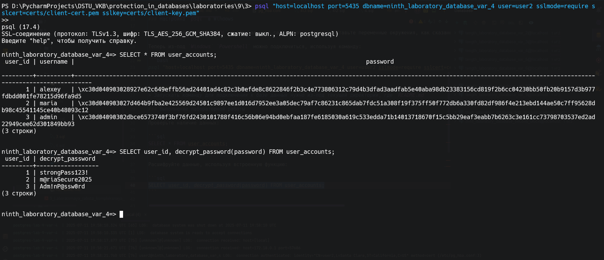
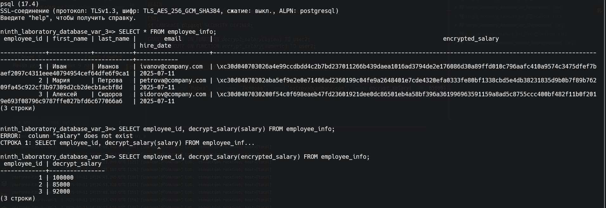

# Вариант 4

Создайте таблицу `user_accounts` с полями `user_id`, `username`, и `password`. Поле `password` должно быть зашифровано с
использованием симметричного метода. Настройте сервер `PostgreSQL` так, чтобы требовалась проверка клиентского
сертификата при подключении.

> [!IMPORTANT]
> Перед запуском скопируйте содержимое `.env.example` в `.env` файл. 
> После этого можете запустить, используя `docker compose up --build`.

> [!NOTE]
> В `IDEA` / `Pycharm` нестабильный драйвер для подключения по `SSL`. 
> В `pgadmin4` нет функционала по подключению через `SSL`.
> Из вариантов - использование только командой строки. 

### Настройка `psql` в Windows

Скачайте клиент `PostgreSQL` с официального сайта, после этого проставьте переменные окружения, как сказано на фото.

Теперь из-под `Windows` `Powershell` можно подключиться, используя команду: 

```bash
psql "host=localhost port=5435 dbname=ninth_laboratory_database_var_4 user=user2 sslmode=require sslcert=certs/client-cert.pem sslkey=certs/client-key.pem"
```

> [!NOTE]
> Запускать команду для подключения к базе данных нужно из-под текущей директории, где `README.md`


### Выполнение лабораторной работы

Проверьте наличие данных:

```sql
SELECT * FROM user_accounts;
```

Расшифруйте данные, используя встроенную функцию: 

```sql
SELECT user_id, decrypt_password(password) FROM user_accounts;
```

Вставьте новые данные:

```sql
INSERT INTO user_accounts (username, encrypted_password)
VALUES
    ('alexey', encrypt_password('strongPass123!'));
```



> [!IMPORTANT]
> На стороне сервера невозможно настроить `verify-x` - это клиентская настройка, не более того. 
> https://postgrespro.ru/docs/postgrespro/current/libpq-ssl




