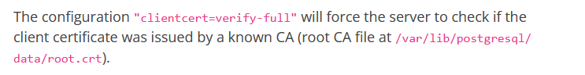
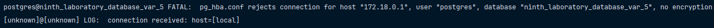
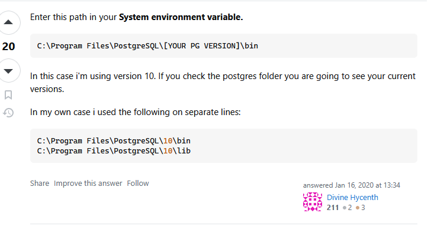

# Вариант 5

Создайте таблицу `medical_records` с полями `record_id`, `patient_name`, и `diagnosis`. Поле `diagnosis` должно быть
зашифровано симметричным шифрованием. Настройте `PostgreSQL` на использование SSL, принуждая клиента
подключаться с `sslmode=require`.

> [!IMPORTANT]
> Перед запуском скопируйте содержимое `.env.example` в `.env` файл. 
> После этого можете запустить, используя `docker compose up --build`.

> [!NOTE]
> В `IDEA` / `Pycharm` нестабильный драйвер для подключения по `SSL`. 
> В `pgadmin4` нет функционала по подключению через `SSL`.
> Из вариантов - использование только командой строки. 

### Настройка `psql` в Windows

Скачайте клиент `PostgreSQL` с официального сайта, после этого проставьте переменные окружения, как сказано на фото.

Теперь из-под `Windows` `Powershell` можно подключиться, используя команду: 

```bash
psql "host=localhost port=5435 dbname=ninth_laboratory_database_var_5 user=user2 sslmode=require sslcert=certs/client-cert.pem sslkey=certs/client-key.pem"
```



Проверим, что нельзя подключиться по обычному паролю:

```bash
psql "host=localhost port=5435 dbname=ninth_laboratory_database_var_5 user=user2"
```



> [!NOTE]
> `myuser` и `postgres` нужны, чтобы `Docker` контейнер мог запуститься.

> [!NOTE]
> Запускать команду для подключения к базе данных нужно из-под текущей директории, где `README.md`



### Выполнение лабораторной работы

Проверьте наличие данных:

```sql
SELECT * FROM medical_records;
```

Расшифруйте данные, используя встроенную функцию: 

```sql
SELECT patient_name, decrypt_diagnosis(diagnosis) FROM medical_records;
```

Вставьте новые данные:

```sql
INSERT INTO medical_records (patient_name, diagnosis)
VALUES
    ('Евгений Жопин', encrypt_diagnosis('Гонорея'));
```

> [!IMPORTANT]
> На стороне сервера невозможно настроить `verify-x` - это клиентская настройка, не более того. 
> Если я передам больше сертификатов, то смогу подключиться по режиму даже выше. То есть нельзя строго сказать,
> что я могу задать только `verify-full` подключение. 
> https://postgrespro.ru/docs/postgrespro/current/libpq-ssl

