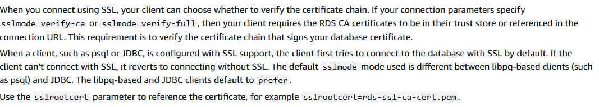

# Вариант 6

Настройте `SSL`-соединение с `PostgreSQL`, используя самоподписанные сертификаты. Создайте таблицу
`secure_messages` с полем message, которое должно быть зашифровано при вставке и расшифровано при выборке.

> [!IMPORTANT]
> Перед запуском скопируйте содержимое `.env.example` в `.env` файл. 
> После этого можете запустить, используя `docker compose up --build`.

> [!NOTE]
> В `IDEA` / `Pycharm` нестабильный драйвер для подключения по `SSL`. 
> В `pgadmin4` нет функционала по подключению через `SSL`.
> Из вариантов - использование только командой строки. 

### Настройка `psql` в Windows

Скачайте клиент `PostgreSQL` с официального сайта, после этого проставьте переменные окружения, как сказано на фото.

Теперь из-под `Windows` `Powershell` можно подключиться, используя команду: 

```bash
psql "host=localhost port=5435 dbname=ninth_laboratory_database_var_6 user=user2 sslmode=verify-full sslrootcert=certs/ca.pem sslcert=certs/client-cert.pem sslkey=certs/client-key.pem"
```


### Выполнение лабораторной работы

Проверьте наличие данных:

```sql
SELECT * FROM secure_messages;
```

Расшифруйте данные, используя встроенную функцию:

```sql
SELECT 
    id, 
    created_at, 
    decrypt_message(message) AS decrypted_message
FROM secure_messages;
```

Вставьте новые данные:

```sql
INSERT INTO secure_messages (message) VALUES (encrypt_message('Секретное сообщение 2'));
```

> [!IMPORTANT]
> На стороне сервера невозможно настроить `verify-x` - это клиентская настройка, не более того. 
> Если я передам больше сертификатов, то смогу подключиться по режиму даже выше. То есть нельзя строго сказать,
> что я могу задать только `verify-full` подключение. 
> https://postgrespro.ru/docs/postgrespro/current/libpq-ssl



> [!IMPORTANT]
> В моем случае и так самоподписанные сертификаты. 