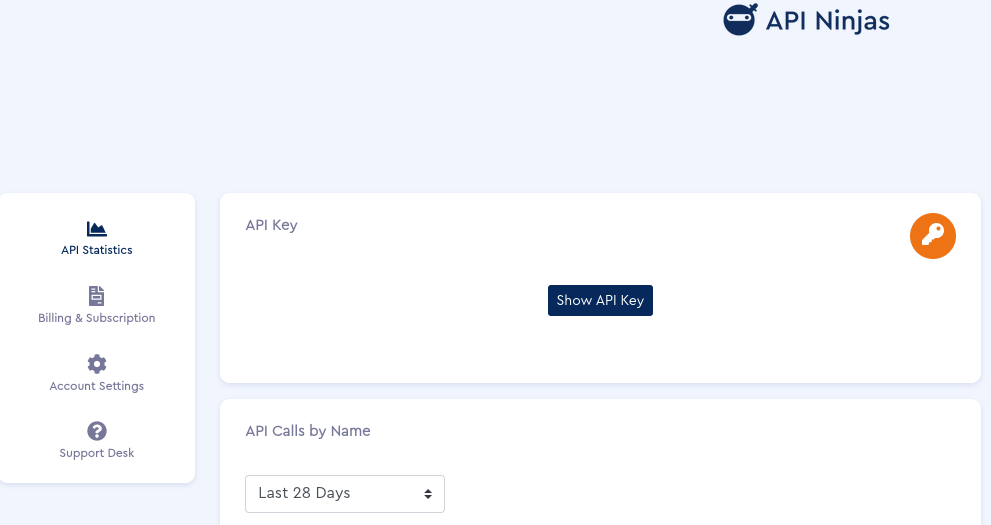
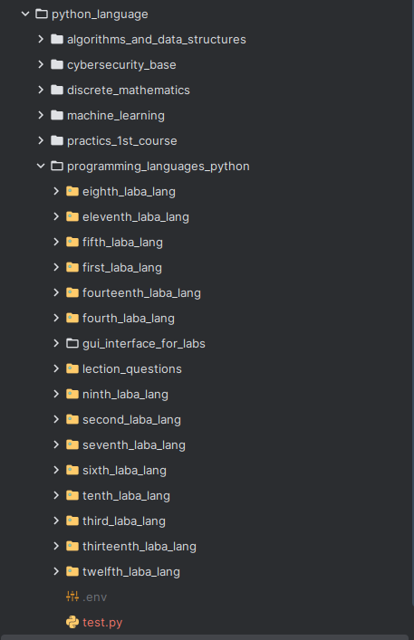

### Если хотите скопировать работы по Python:
Работа с git в Pycharm:
- https://youtu.be/9VKKZNqzPcE?si=hPIF4CO-z2XwHQ59
- https://youtu.be/hqDWXBlQG5c?si=EgsIiGACwZwbH1LG

Установка всех зависимостей:
```bash
pip install -r requirements.txt
``` 
---

### Только для 14 лабораторной

API можете получить здесь (это бесплатно) - https://api-ninjas.com

В настройках вашего аккаунта будет API KEY (фото), там вы можете его скопировать.



Вам нужно будет создать .env файл для взаимодействия вставки API токена
Данный файл `.env` должен находится, например, здесь.



Внутри данного файла пишете: `ANIMALS=ВАШ_API_КОД`